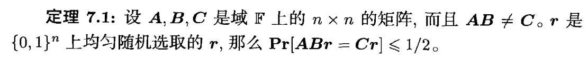
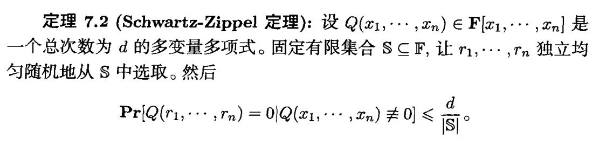
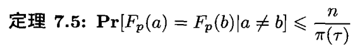

# 指纹和Freivalds技术

Freivalds技术：
    如果对下面三个矩阵进行验证是否相等，AB=C。我们采取如下的算法：

1. 选择一个随机向量$\bold{r}\in \{0,1\}^n$,
2. 计算$\bold{x=Br,y=Ax=ABr,z=Cr}$,验证$\bold{y=z}$

上述的定理启发我们设置一种居于多变量多项式的指纹技术。

对于进行两个大小为n序列$A(a_1,a_2,...,a_n),B(b_1,b_2,...,b_n)$比较他们是否相等。
算法：
1. 构造一个总次数为`d`,项数为`n`的多项式，每个多项式的系数为对应集合的元素。由此，我们得到了两个多项式$F_A,F_B$.我们的任务变成了验证该多项式是否相等。
2. 固定一个子集$\mathbb{S}$,从中抽取$x_1,x_2,x_3...，$验证$F_A(x_1,x_2...)\%p=F_B(x_1,x_2...)\%p$

# 验证串是否相等

问题：验证串A，B是否相等。
将A，B看作一个n比特的整数a,b;

$a=\sum_{i=1}^n a_i2^{i-1},b=\sum_{i=1}^nb_i2^{i-1}$

得到的数对p进行取模运算得到$F_x=x\ mod \ p,F_a,F_b$

$$
这里的\pi(\tau)-小于\tau的素数个数 \approx \frac{\tau}{\ln \tau},\\
p是在小于\tau下选取的最大素数 ,最终得到的通信的比特数为\log \tau
$$

# 模式串识别

上述的指纹技术可以用于模式串的识别上

对于$X_i$的指纹，可以从$X_{i-1}$常数时间得到。

