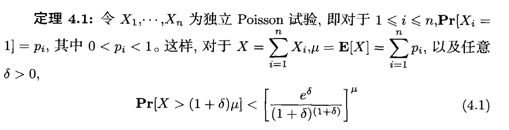
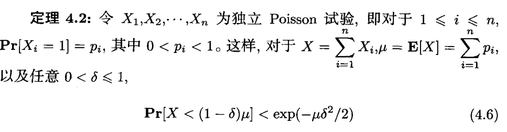
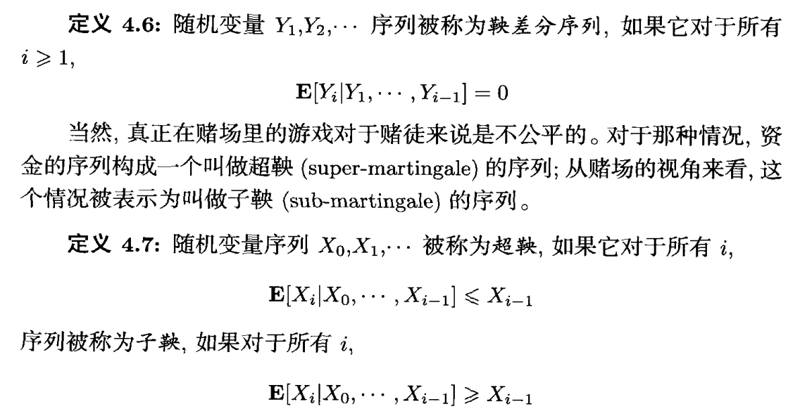
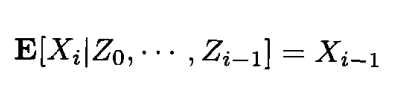
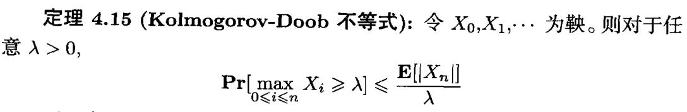
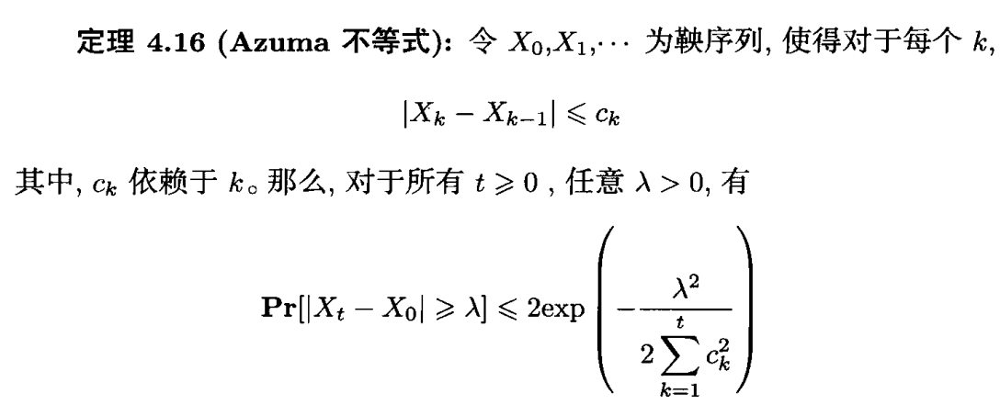
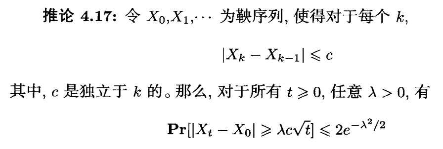

# Chernoff 界

硬币投掷的伯努利试验和泊松实验：
$$
令 X_1,….,X_n。为独立 Bernoulli 试验，即对于1≤i≤n,Pr[X_i=1] = p且 Pr[X_i= 0] = 1 -p。令X =\sum_i^nX_i;\\则X称为具有二项分布。更加一般的，令 X1,…·, X，为独立硬币投掷，即对于1 ≤i≤n,Pr[X_i=1] = P；且Pr[X_i= 0] = 1- Pi。这样的硬币投掷称为 Possion 试验。\\即每次实验的概率不同。
$$
给出定理：

上述的证明主要使用生产函数来解决。证明参见《随机算法》P70.

上述定理给出了上界的概率，而对于如下问题：当$\delta$多大才能使得$Pr(X>(1+\delta)\mu)$至多为0.01.

# 鞅

鞅的定义：

更加一般且富有含义的定义：

鞅的思想是：$X_{i+1}实在X_i上更加细化的划分，F_0是未划分的空间，F_n是在全局空间\Omega上的采样$

## 鞅尾不等式

推论：

