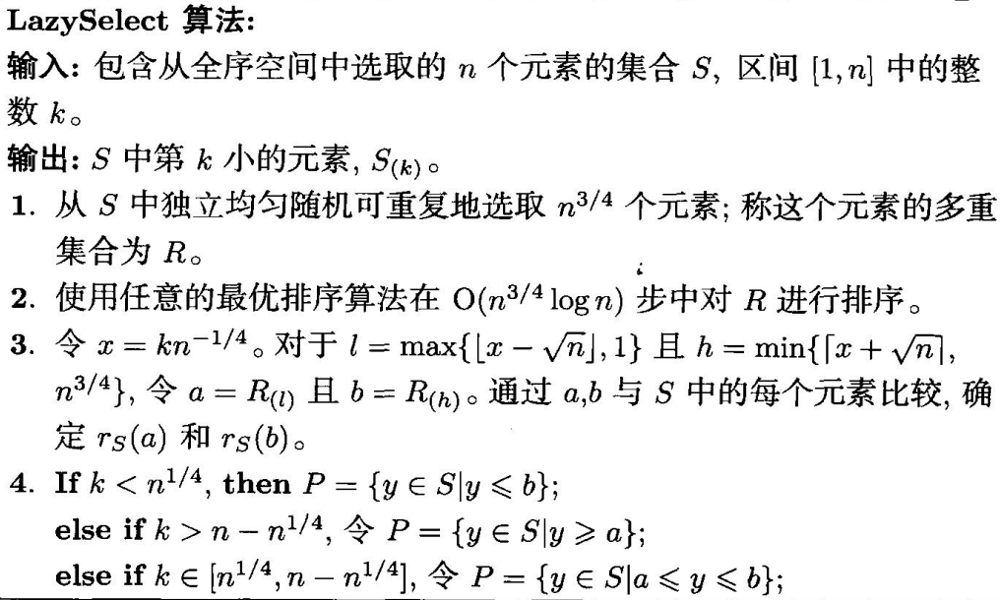
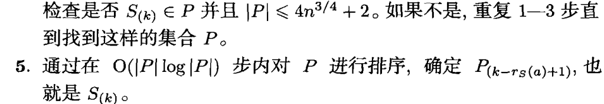
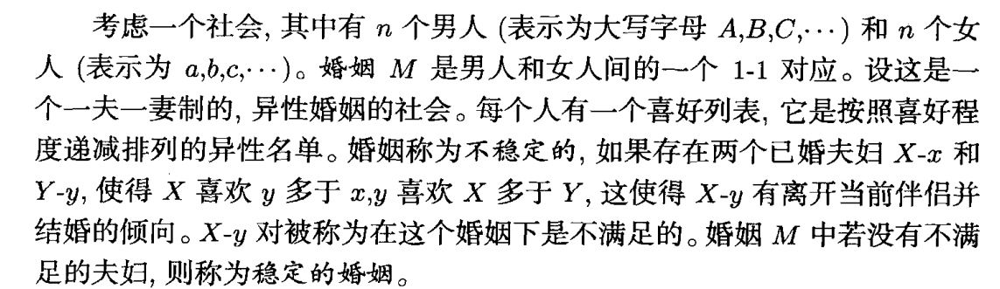
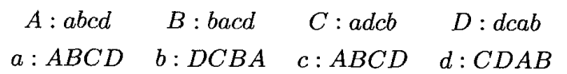
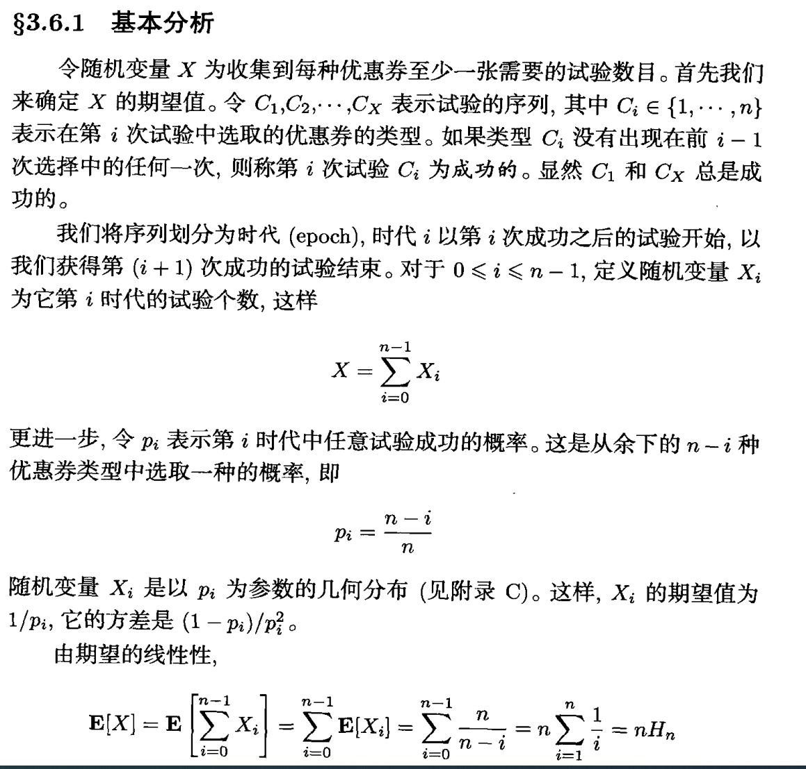
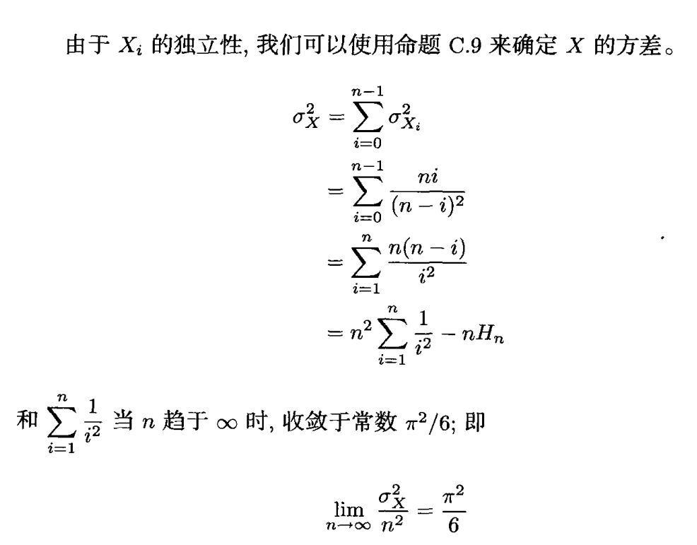
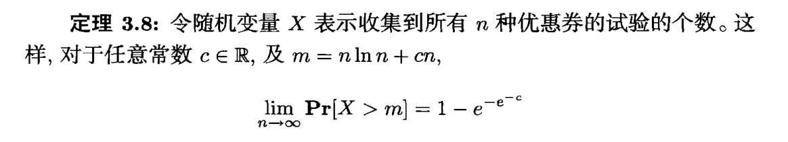

# 占有问题

将m个球放入n个箱子了，当m=n时，该问题为占有问题。

> 定理3·1：以至少1-$O(\frac{1}{n})$的概率，没有箱子有比$k=(e\ln n)\ln \ln n$更多的球在其中。

# 马尔可夫不等式和切比雪夫不等式

马尔可夫不等式:
当X是非负随机变量时，对于任意正数a，有马尔可夫不等式：

$$P(X \geq a) \leq \frac{E(X)}{a}$$

切比雪夫不等式：

当X是任意随机变量时，对于任意正数a，有切比雪夫不等式：

$$P(|X-E(X)| \geq a) \leq \frac{Var(X)}{a^2}$$

> 推广：

$$
h(x)为非负函数，马尔可夫不等式可以写作：\\
P(h(x)\geq a) \leq \frac{E(h(x))}{a}
$$

# 随机选择

问题：在无序的序列中选取第k小的数。

LazySelect方法：

目前确定性的算法需要至少`3n`的时间，而lazySelect算法只需要`2n+o(n)`即可解决，

# 两点采样

我 们 考 虑 这 些 概 念 的 一 个 应 用 , 即 减 少 RP 算 法 (如果正确，算法以大于$1/2$概率输出1，如果错误算法输出0) 使 用 的 随机 比 特 的 数 目 。 考 虑 一 个 RP 算 法 4, 它 确 定 输 人 串 心 是 否 属 于 语 言 L。 给定 , 对 于 合 适 的 素 数 n,4 从 Z, = {0, … ,n - 1} 中 选 取 随 机 数 r, 使 用 下 面
的 性 质 计 算 一 个 二 进 制 值 A(z,i):
* 如 果 z $\in L$  , 那 么 对 于 r 的 至 少 - 半 可 能 值 , A(z,i) = 1
* 如 果 z $\notin L$ , 那 么 对 于 r 所 有 可 能 值 , 4(z,i) = 0
对 于 随 机 选 择 的 i,A(z,r) = 1 是 $z \in L$ 的 确 定 证 明 , 而 A(z,i) = 0 是
$z \notin L$ 的 见 证 。

朴素想法：
    随机抽样`t`个独立的数，发生错误的概率为$2^{-t}$,占用空间为$t\log n$.

随机算法：
    随机在`n`中抽样`a,b`，对于$1\leq i \leq t$求取 $a*i+b$用作代替，由于他们得到的数是独立的，最终发生错误的概率为 $\frac{1}{t}$,占用空间为$2\log n$。

# 稳定婚姻

一个简单的求婚列表：

性质：
> 必定存在一个稳定的婚姻

求婚算法($n^2$)：

    1. 男人以任意形式排序，每次抽取编号最小的男人，向他的列表中未被拒绝的女性（可以是已婚）求婚。
    2. 女性如果未婚或者当前伴侣Y吸引度小于X，就接受X的求婚（Y就重新变为未婚，返回1）
    3. 重复1，知道所有人已婚

算法分析：
    1. 女人一旦已婚，整个过程都是已婚状态，并且伴侣对她的吸引度会不断升高
    2. 每个人至多求婚n次，因此算法为$n^2$
    3. 使用上述1，2性质，加上反证法可以证明算法一定找到一个稳定的婚姻

显然，$n^2$是一个很松的上界，算法的时间复杂度和求婚的次数有关。令$T_A$表示遗忘算法（每次都向所有女性求婚，遗忘了拒绝的女性），$T_P$表示不遗忘。下述定理可以通过优惠券收集问题算法证明：
$$
对于任意常数c\in \bold{R},且m = n\ln n+cn,\\
\lim\limits_{n\to\infty}\mathbf{Pr}[T_A>m]=1-e^{-e^{-c}}
$$

# 优惠券收集问题

由于调和数 `H(n) ~ nln n + O(1)`

