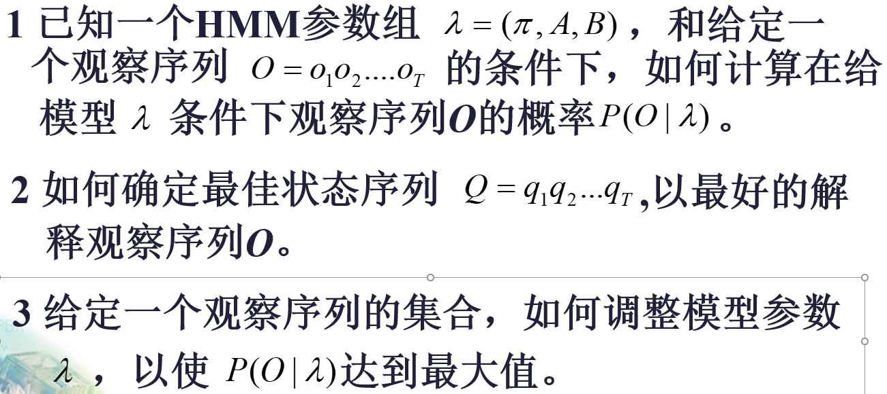

**首先看PPT，了解基本概念**

- 性质。无后效性
- C-K方程
- 可达和相通以及推导出的性质。
- 常返和非常返。如何推导。
- 常返中的正常返和零常返。
- 闭集和推导出的性质。
- 马尔科夫链的平稳分布和极限分布。

****

**隐马尔可夫模型需要查资料**

HMM的三个基本问题

## 1. 评估问题

考虑最简单的办法：穷举A中所有的状态，并通过观测矩阵计算到达当前观察序列的概率并相加。$O(a^T*b)$
使用递推算法（前向算法和后向算法），马尔科夫链具有无后效性，可以使用递推。

---
[前向算法](https://www.cnblogs.com/kaituorensheng/archive/2012/12/01/2797230.html#:~:text=%E9%9A%90%E9%A9%AC%E5%B0%94%E5%8F%AF%E5%A4%AB%E6%A8%A1%E5%9E%8B%EF%BC%88%E4%B8%89%EF%BC%89%E2%80%94%E2%80%94%E9%9A%90%E9%A9%AC%E5%B0%94%E5%8F%AF%E5%A4%AB%E6%A8%A1%E5%9E%8B%E7%9A%84%E8%AF%84%E4%BC%B0%E9%97%AE%E9%A2%98%20%28%E5%89%8D%E5%90%91%E7%AE%97%E6%B3%95%EF%BC%89%20%E9%9A%90%E9%A9%AC%E6%A8%A1%E5%9E%8B%E7%9A%84%E8%AF%84%E4%BC%B0%E9%97%AE%E9%A2%98%E5%8D%B3%EF%BC%8C%E5%9C%A8%E5%B7%B2%E7%9F%A5%E4%B8%80%E4%B8%AA%E8%A7%82%E5%AF%9F%E5%BA%8F%E5%88%97O%3DO%201,O%202...O%20T%20%EF%BC%8C%E5%92%8C%E6%A8%A1%E5%9E%8B%CE%BC%3D%EF%BC%88A%2CB%2C%CF%80%7D%E7%9A%84%E6%9D%A1%E4%BB%B6%E4%B8%8B%EF%BC%8C%E8%A7%82%E5%AF%9F%E5%BA%8F%E5%88%97O%E7%9A%84%E6%A6%82%E7%8E%87%EF%BC%8C%E5%8D%B3P%20%28O%7C%CE%BC%7D)

P[i,j]表示在时间i为第j个状态的概率且观察序列为$O_{1..i}$，它可以通过p[i-1,...]推导出
$$
P[i,j] = (\sum_{k=0}^{n}P[i-1,k] * A[k,j]) * B[j,O_i]
$$
最终得到的答案
$$
Ans = \sum_{j=0}^{n}P[T,j]
$$

## 2. 解码问题

也可以通过枚举出所有的序列然后计算概率，求出最大。

[维特比算法](https://zhuanlan.zhihu.com/p/427893197)

就是最简单的动态规划问题。

P[i,j]表示在时间i为状态j且观测序列为$O_{1...i}$，在使用一个pre[i,j]数组记录一下前置的路径

$$
P[i,j] = \max_{k\in S}{P[i-1,k]*A[k,j]} * B[j,O_i]

\\
Ans = \max_{j\in S}{P[T,j]}
$$

## 3.学习问题

目前没有一个完备的算法能够达到最优的模型，

[学习问题](https://blog.csdn.net/weixin_43868020/article/details/106393520)