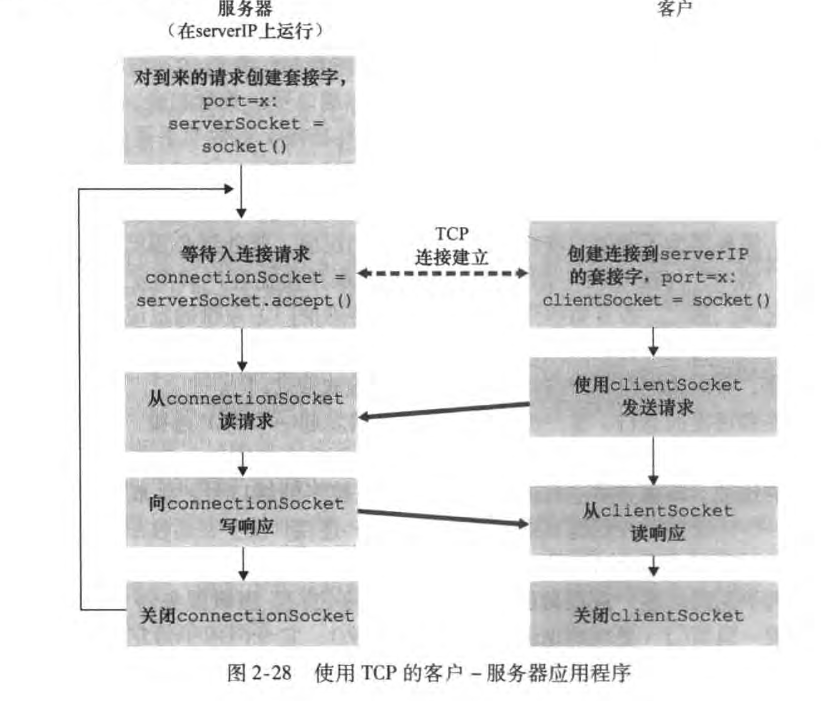

[toc]

### 常用协议及端口

| 常用协议 | 端口   |
| -------- | ------ |
| FTP      | 20、21 |
| HTTP     | 80     |
| HTTPS    | 443    |
| Telnet   | 23     |
| SMTP     | 25     |
| DNS      | 53     |
| POP3     | 110    |
| IMAP     | 143    |

**备注：端口0被默认为无效端口**

## 应用层的主要原理

### 应用程序的体系结构

#### 客户-服务器结构（CS）

- 总是打开等待连接的主机叫做**服务器**，主动建立连接的成为客户。
- 客户之间并不相互通信。
- 常常会配备数据中心提供服务。

#### P2P结构

- 应用程序在简短连接的主机之间使用直接通信。
- 具有强大的自拓展性。
- 通常不需要庞大的基础设施和带宽。
- 面临安全性、可靠性和性能的挑战

### 应用程序服务设计分类

- 可靠性。是否能够承受一定量的数据丢失。
- 吞吐量。应用是否对带宽敏感。
- 定时。应用是否要求低的延时
- 安全性。数据是否可以加密
- 


## 主要的网络应用与网络协议

### Web应用与HTTP协议

#### 简介

**RTT（Round-trip Time）:指的是一个很短的分组（忽略发送时延）从服务器发出到客户，然后再从客户返回服务器的总时间**

HTTP协议具有以下特点：

- HTTP1.0采用非持续连接，对于每一个对象都需要建立一个TCP连接进行传输，HTTP1.1采用持续性连接。
- HTTP不保存关于客户的信息，是一个无状态协议，可以通过使用Cookies来追踪客户信息。

#### HTTP请求报文


<center>HTTP请求报文</center>

- 第一行称为请求行，包括命令、URL和HTTP版本。命令包括GET、POST、HEAD，PUT、DELETE。

| 命令   | 功能           |
| :----- | :------------- |
| GET    | 请求获取对象   |
| POST   | 提交表单       |
| HEAD   | 调试使用       |
| PUT    | 上传对象       |
| DELETE | 删除服务器数据 |

**用户使用表单提交申请不一定需要使用POST，也可以使用GET，例如，www.example.com/search?monkey**

- 其他行称为首部行，提供额外的信息。Host指明对象主机，Connection表明传输是否关闭链接，User-agent指明用户代理，一般是浏览器，Accept-language：表明语言。


#### HTTTP响应报文


- 第一行为初始状态行，表明协议和相应状态

| 序号 | 状态                       | 备注             |
| :--- | :------------------------- | :--------------- |
| 200  | OK                         |                  |
| 301  | Moved Permanently          |                  |
| 400  | Bad request                | 一般是请求行错误 |
| 404  | not found                  |                  |
| 505  | HTTP version not supported |                  |

#### Cookie技术

- 在相应报文中添加set-cookie首部行，之后访问该网站，请求报文中会包含cookie首部行
- 用户客户端会保存一个cookie文件，专门存储各个网站的cookie
- 服务器会在数据库内保存用户的各类数据。


#### Web缓存

原理：通过缓存最新、最常用的网页对象来达到提高访问速率、节省带宽的作业。

- Web缓存服务器既是客户，又是服务器。它接受来自普通客户的访问，又要访问网页服务器来获取最新内容。

> 如何判断是否缓存的内容是否为最新的版本？

> Web缓存服务器通过条件GET来对内容进行更新，条件GET在首部行中添加了一个if-modified-since，记录了内容最新的时间。当用户访问网页时，Web缓存服务器首先向网页服务器发送一个条件GET，如果内容没有修改，网页服务器会返回一个不具备实体数据的响应报文（节约带宽）；否则就会返回最新内容，Web更新其内容，最后返回给用户。

### 电子邮件与SMTP、POP3、IMAP协议

#### SMTP

- SMTP协议用于电子邮件的发送，端口为25.
- SMTP是一个推协议（push），它负责将邮件推向邮件服务器。而HTTP为一个拉协议（pull）
- SMTP协议要求每个报文采用7bit的ASCII格式，要求所有文件（包括图像）按照7bitASCII进行编码。

#### POP3、IMAP

- POP3 是用于邮件接收方接受邮件的协议，它支持接受，删除邮件。
- 它具有用户认证、事务处理和更新三个阶段。认证和更新阶段即用户登录，更新邮件信息。事务处理阶段包含list、retr、dele、quit四个命令。
- IMAP相比于POP3增加了允许用户

> 1. 创建远程文件夹
> 2. 获取报文的某一部分而不是全部内容


<center> 邮件传输</center>

**发送方服务器到接收方服务器之间的传输协议仍然是SMTP协议**

### 因特网目录服务与DNS协议

- DNS协议居于UDP运输层协议,使用53端口
- DNS服务器采用分布式、层次化的数据库设计，包括根服务器、顶级服务器和权威服务器。
- DNS缓存通过缓存可以提升速率，降低带宽使用。
- DNS可以递归查询和迭代查询，递归查询由低到高询问，迭代查询从根服务器开始查询。

  
- DNS数据库的报文，包含一个(name,value,type,TTL)的四元组，TTL记录生存时间，防止无用的UDP流持续存在在网络中，可以忽略。

| Type  | 功能                   | 案例                                |
| :---- | :--------------------- | :---------------------------------- |
| A     | 主机和IP地址的映射     | （www.example.com,123.123.90.127,A) |
| NS    | 主机别名               | (foo.com,dns.foo.com,NS)            |
| CNAME | 规范主机名             | （）                                |
| MX    | 邮件服务器的规范主机名 |                                     |

- DNS展现了强有力的健壮性，可以抵御大部分的网络攻击。

## P2P文件分发

### 文件分发效率

考虑向N个客户分发F bit大小的文件，服务器的上传速率为$u_s$,所有客户最小的下载速率为
$d_{min} = min(d_1,d_2,...,d_n)$,每个客户的上传速率为$u_i$.

#### CS架构效率

- 服务器上传所有的文件所需要的时间为$\frac{NF}{u_s}$
- 最后一个客户下载所需时间为$\frac{F}{d_{min}}$

那么就可以得到服务器完成分发的时间为

$$
D_{cs} = max(\frac{NF}{u_s},\frac{F}{d_{min}})
$$

#### P2P分发效率

- 服务器至少需要上传一个完成的文件，所需时间为$\frac{F}{u_s}$
- 最后的客户下载文件需要时间为$\frac{F}{d_{min}}$
- 系统整体的上载能力为 $u_s + \sum_{i = 1}^{n}{u_i}$,整个系统需要上载NF 文件，所需的时间为$\frac{NF}{u_s+\sum_{i=1}^{n}{u_i}}$.

综上，P2P的总时间为：

$$
D_{p2p} = max(\frac{F}{d_{min}},\frac{F}{u_s  },\frac{NF}{u_s+\sum_{i = 1}^{n}{u_i}})
$$

### BitTorrent协议

- 洪流。对于每个下载特定文件的所有主机的集合称为洪流。
- 追踪器。主机当加入洪流（开始下载），会向追踪器注册，并且会周期告诉追踪器仍在下载文件中。
- 邻近对等方。主机可以建立连接，获取文件块的主机列表。
- 最稀缺有限策略。主机会优先下载在邻居中最稀缺的文件块。
- 疏通。主机会选择能够以最高速率向它传输速率的四个邻居下载文件，并且向这四个邻居传输文件。这个策略被称为“tit-for-tat（一报还一报）”

## 套接字编程

套接字实现两个通信进程之间的交互

### UDP Socket


<center>UDP Socket Process</center>

```python
from socket import *

serverName = "hostname"
serverPort = 12000
clientSocket = socket.socket(socket.AF_INET, SOCK_DGRAM)
message = input("message")
clientSocket.sendto(message.encode(),(serverName, serverPort))
recv_message,recv_adress = clientSocket.recvfrom(1024)
print("received message")
clientSocket.close()
```

<center>Server Code </center>

```python
from socket import *
serverPort = 12000
serverSocket = socket(AF_INET,SOCK_DGRAM)
serverSocket.bind(('',serverPort))
print("server is ready to connect")
while True:
    message, clientAddress = serverSocket.recvfrom(2048)
    retrieved = message.decode().upper()
    serverSocket.sendto(retrieved.encode(),clientAddress)
  
```

### TCP Socket



<center>TCP Socket Process </center>

<center>Client Socket Code </center>

```python
from socket import *

serverName = 'serverName'
serverPort = 12000
clientSocket = socket(AF_INET, SOCK_STREAM)
clientSocket.connect(serverName, serverPort)
sentence = input("input something!")
clientSocket.send(sentence.encode())
modified = clientSocket.recv(1024)
print("recieve message from server")
clientSocket.close()
```

- 相比于UDP，TCP多了一个connect过程，同时发送信息的时候并不需要指定端口和地址

<center>Server Socket Code </center>

```python
from socket import *

serverPort = 12000
serverSocket = socket(AF_INET, SOCK_STREAM)
serverSocket.blind(('',serverPort))
serverSocket.listen(1)
print("server is listening on")
while True:
    connectionSocket,addr = serverSocket.accept()
    sentence = connectionSocket.recv(1024).decode()
    upper_sentence = sentence.upper()
    connectionSocket.send(upper_sentence.encode())
    connectionSocket.close()
  
  
```

- 在建立连接之后服务器需要新建一个套接字与客户进行通信（TCP连接是一对一的，这个Socket只用于处理请求）
-
