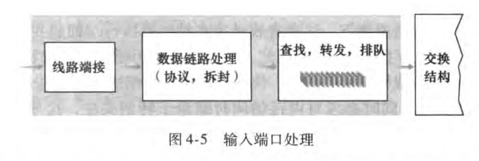
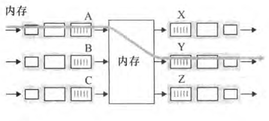
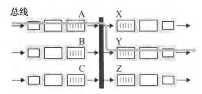
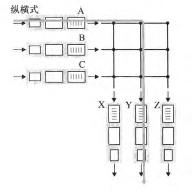

#计算机网络层

## 概述

网络层可以分为数据平面和控制平面。

- 数据平面：负责从输入链路向输出链路转发数据报
- 控制平面：协调链路中各个路由器的各个动作，是的数据报沿着链路进行端到端的传送。

网络层提供单一的服务，称为尽力而为服务（best-effort service)。

- 不保证数据被按序接受
- 不保证可靠性（数据一定会被接受）
- 不保证端到端时延和最小带宽

  ## 路由器工作原理

  路由器由以下部分构成

  - 输入端口。输入端口执行数据的输入和查找功能（决定本地输出端口）。
  - 交换结构。交换结构将输入端口和输出端口相连
  - 输出端口
  - 路由选择处理器。执行路由选择协议，并计算转发表。

### 输入端口

输入端口的查找功能通过使用分组目的地址的前缀，使用最长前缀匹配规则来实现，存储和查找转发表通常使用特定硬件完成，对于32位地址能够在常数时间内完成查询。

### 交换

交换结构实现分组由输入端口交换到输出端口
 

分组交换主要具有以下三种类型：

经内存交换
 

- 经内存交换。这个方式类似传统计算机的I/O机制，输入端口将分组写入内存，输出端口从内存读出分组。

经总线交换

- 经总线交换。这个方法类似传统计算机的总线通信。每次总线会向所有端口发送数据，只有目的端口会保留数据并转发，其他端口都会舍弃分组。

经过互联网洛交换

- 经互联网络交换。每个相交的节点都具有一个控制装置，可以开合。

