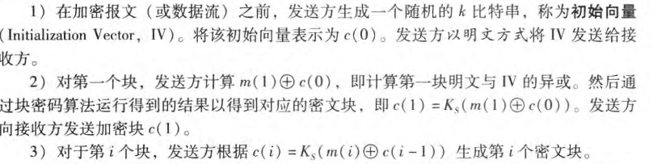
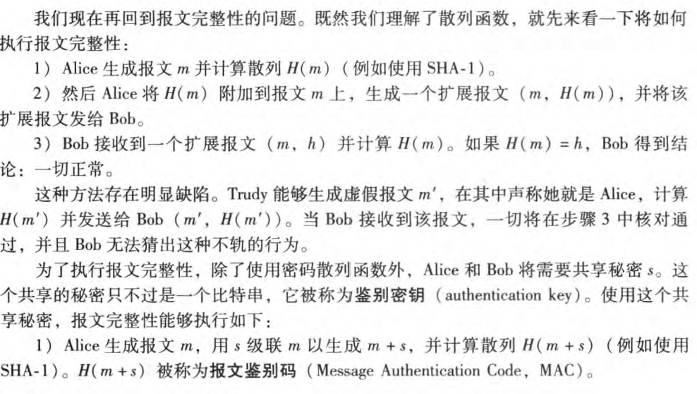
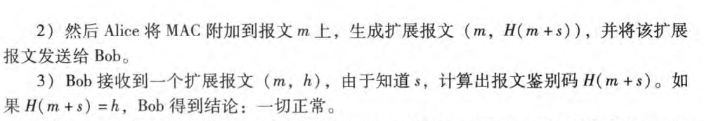

# 对称密钥密码体制

加密双方约定一个hash密码函数，通过将明文进行加密，然后在接收方进行解密。

## 块密码

1. 对于固定长度的块进行一一映射，生成密文。
2. 同时还需要生成一个排列表，来打乱生成的密文。
3. 为了添加随机性，还引入了一个随机生成的变量，将明文与之异或之后在加密，通常，一开始传输就传输这个随机生成的变量，并且不断的使用加密算法来生成该变量的后继来进行异或。

# 公共密钥密码体制

BOb要求具有对应的公钥和密钥$(K_{public},k_{private})$,Alice向Bob发送明文时，使用$K_{public}(data)$进行加密，Bob在收到密文时，使用$K_{private}(K_{public}(data)) =K_{public}(K_{private}(data))=data$的方式进行解密。

## RSA

RSA的加密基础是：不存在一个算法能够快速的对一个大整数进行因式分解。

**首先，需要明确：我们可以将所要传输的数据看作为一个个整数**

### 公钥和私钥的生成

1. 选取两个很大的素数p,q.p,q越大，越难破解。通常要求p,q乘积为一个1024比特数量级的大整数。
2. 计算$n=pq,z=(p-1)(q-1)$
3. 选择一个数e,使得$(e,z)=1$,这个e将会被用于公钥加密。
4. 求取一个数d，使得$ed \equiv 1(mod\ z)$,d将会被用于私钥的解密。
5. 发布的公钥为$K_{public} = (n,e)$,发布的私钥为$K_{private} = (n,d)$

### 公钥加密过程和私钥解密

Alice要发送一个m比特的整数给Bob，m < n,此时生成的密文 c 就为：

$$
c = m^e \ mod \ n
$$

Bob收到密文c之后进行解密：

$$
m = c^e \ mod \ n
$$

如果要自行推导，需要借助以下定理

$$
\text{if p,q are two primes,and} \\n = pq,z=(p-q)(q-1),\\
then \\
x^y \equiv x^{y\ mod\ z} (mod\ n)
$$

在实际过程中,RSA计算往往过于缓慢，因此通常使用RSA来加密对称密钥密码中的密钥。然后使用对称密钥进行数据的传输。

# 报文完整性和数字签名

目前，通过使用MD5和SHA-1两种hash函数生成一个128比特（MD5）或者160比特（SHA-1)来进行表示。

## 数字签名

前面接受的RSA，每个用户都保留一个私钥，通过使用这个私钥来对报文进行加密$K_{private}(data)$，可以生成一个独特的序列，任何接受方可以使用公钥来进行验证.
前面说过，数据很长，RSA处理很慢，所以可以通过约定一个通用的hash函数来先对数据进行hash处理，然后才进行私钥加密，从而生成一个短得多的序列，称为数字签名。