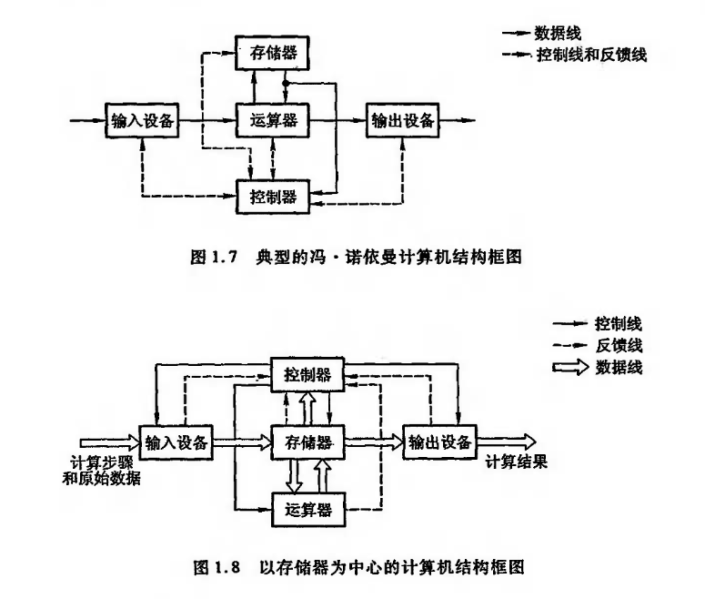
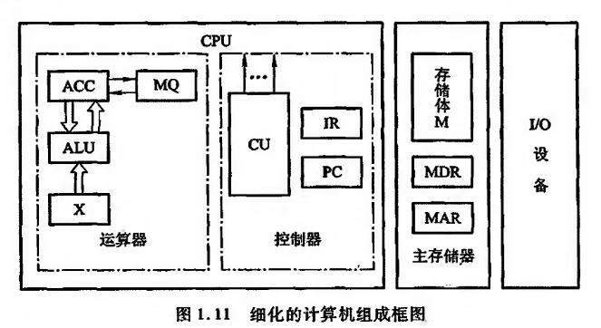
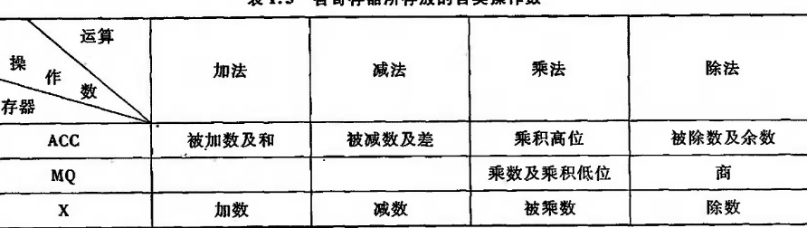
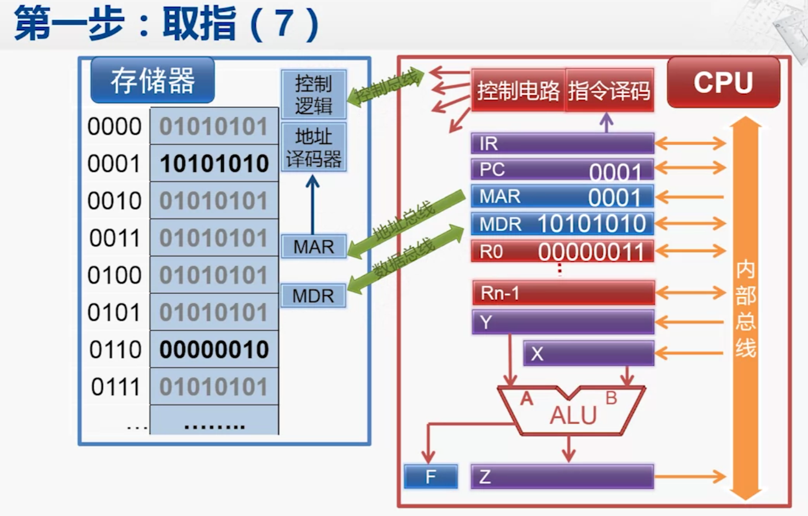
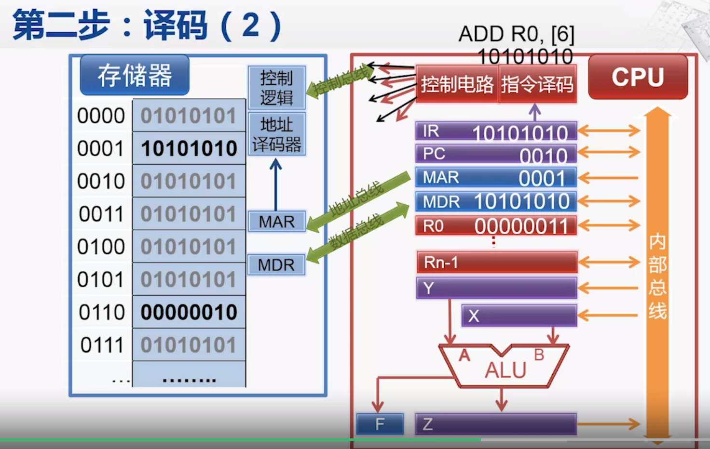

[toc]

# 概论

## 简要知识点

- 冯诺依曼计算机特点

> 1. 由运算器、存储器、控制器、输入、输出设备五大部件构成
> 2. 指令和数据以同等地位存储在存储器中，按地址访问
> 3. 指令和数据按二进制表示
> 4. 指令由操作码和地址码组成
> 5. 机器以运算器为中心。（现在的计算机一般以存储器为中心）

- 计算机结构框图

判断框图是以运算器还是存储器为中心，看输入输出设备是否与存储器直接相连

## 计算机内部寄存器

1. 存储器内部由两个寄存器MAR（memory address register），MDR(memory data register).MAR存储访问的存储单元的地址，MDR存储取出的数据，MAR位数对应存储单元的个数，MDR的位数对应存储字长。
2. 运算器中具有三个寄存器，ACC，MQ,X。分别存储以下内容。

寄存器存储内容

3. 控制器具有PC(program counter),IR(instruction register)两个寄存器。PC存放当前执行指令的地址，IR存放当前指令的内容。

## 计算机指令执行过程

1. 取指。
   

 

IP通过地址总线M传输到MAR访问存储器，MDR存储的数据内容通过内部总线传给IR，同时PC+1，

2. 译码。 IR中的内容会传输给控制器，解析指令内容。同时通过控制总线向其他设备发送内容。
   
3. 执行。运算器执行相应的内容
4. 回写。将运算器中的运算结果写回寄存器或者存储器中。

## 计算机硬件主要性能指标

1. 机器字长 

 
指的是CPU一次能够处理数据的位数

2. 存储容量
3. 运算速度
   运用Gibson（吉普森）法，考虑每条指令在全部操作中的占比

$$
T_M = \sum_{i=1}^{n}{f_it_i}\\
$$

$T_M$为运行速度，$f_i$为指令占比， $t_i$为指令运行时间。
现在一般采用MIPS（Million Instructions Per Second）作为计量单位，也采用CPI（cycle Per Instruction）执行一条指令所需要的时钟周期。
