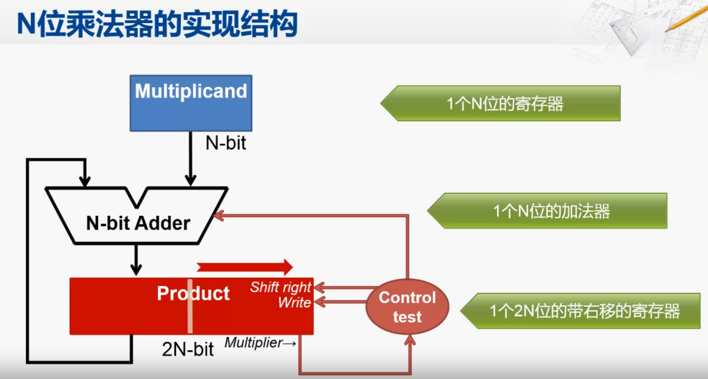
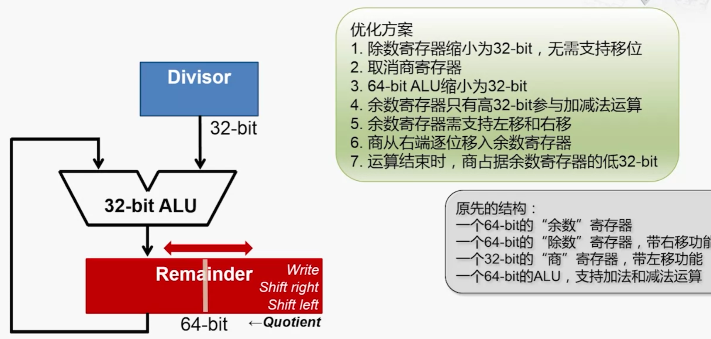
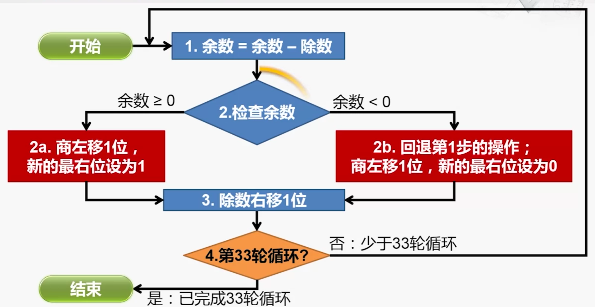

[toc]
# 算术运算的实现

## 加减法运算实现

### 半加器

半加器原理

A与B经过异或门产生输出，经过与门产生进位。

半加器无法处理进位，通过使用两个半加器就可以实现全加器，处理进位。

全加器原理

### 行波进位加法器（Ripple-Carry Adder,RCA）

通过全加器串联得到行波进位加法器

### 加法进位溢出

**最高位的进位输入不等于最高位的进位输出就代表溢出**

### 减法运算

减法运算在加法运算中加入了一个取反的操作，并且在最初的$C_0$进位标志符设为1，

### 超前进位加法器（Carry-Lookahead Adder）

行波进位加法器电路实现简单，但是由于只有当前一位的进位计算出来之后才能计算后一位的结果，因此，计算效率很低。考虑设计一个能够提前计算出进位量的加法器。

推导过程
$$
\begin{aligned}

+ &: 代表或运算\\
*&:代表与运算\\
A_i&:数A的第i位\\
B_i&:数B的第i位\\
C_i&:第i-1位的参数的进位参与i位运算
\end{aligned}
$$
$$
\begin{aligned}
C_i &= (A_i*B_i)+(A_i*C_i)+(B_i*C_i)\\   
    &=(A_i*B_i)+(A_i+B_i)*C_i \qquad  &\qquad(提取出 C_i)\\
    \\
    令G_i = A_i * B_i ,P_i = A_i + B_i\\
    可以得到以下推理:\\
    C_{i+1} &= G_i+ P_i* C_i\\
    我们可以将C_i逐层展开：
\end{aligned}
$$

因此根据推理，我们可以设计出这样的电路：

CLA实现

### CLA实现

### 效率分析
假定通过每一个电子元件所需要的时间为 T

- 对于行波进位加法器,所需要的时间是线性叠加的，总时间为$T_{total} = (2n+1)*T$其中n为加法位数。
- 对于CLA，我们由推到公式和框图可以指导，最多需要通过4个元件，因此为 $4T$，不随位数增长。

- 但是由于CLA的线路实现过于复杂，因此，实际中常常是多个位数小的CLA通过RCA的方式串联而成。

## 乘法运算

### 乘法运算过程
乘法过程中主要维护三个变量：被乘数、乘数和部分积（最初为0）
按照以下过程进行计算：
1. 判断乘数的最后一位是否为1，如果是，部分积加上被乘数
2. 被乘数左移一位。
3. 乘数右移一位，注意是逻辑右移。
4. 循环步骤一，直到乘数所有位都为0，此时部分积就是结果。

###  乘法器的实现

乘法器的实现

控制逻辑实现了上述的步骤。

### 乘法器的优化

- 将乘数放在了记录部分积的继承其的低N位，从而节省计算资源。
- 每次被乘数与该寄存器的高N位相加
- 然后将该寄存器一起右移，而被乘数不必左移
- 节省了寄存器，也减少了逻辑控制

### 考虑补码的乘法(Booth乘法)

$$
\begin{aligned}
[x]_c &= x_0.x_1x_2x_3...x_n   \\
[y]_c &= y_0.y_1y_2y_3...y_n    \\
1. 假定y为正，则可以得到\\
[x]_c*[y]_c &= [x]_c * y,可以直接按照乘法计算\\
2. 假定y为负，那么可以得到\\
[x]_c *[y]_c &= [x]_c * [0.y_1y_2y_3...y_n] + [-x]_c\\

综合1，2可以得到通式：\\
[x]_c *[y]_c &= [x]_c * [0.y_1y_2y_3...y_n] + [x]_c*y_0\\
            &=[x]_c*(-y_0+y_12^{-1}+y_22^{-2}+...+y_n2^{-n})\\
    &=[x]_c*[(y_1-y_0)+(y_2-y_1)*2^{-1}+...+(y_{n+1}-y_n)2^{-n}]\\
    y_{n+1}的初始值为0
\end{aligned}
$$
所以就可以按照上式设计出电路图，每次对于步骤3部分积和乘数的右移根据$y_{n+1}-y_n$判断，而不仅仅是$y_n$.

## 除法运算

除法的结构

工作流程

#### 优化方法
1. 对于回退操作。当余数大于0时，执行$Left*2-y$的操作，当余数小于0的时候，执行$(Left+y)*2-y=Left*2+y$的操作，因此完全可以使用这种加减交替余数法。

#### 补码除法

补码的除法和前面的类似，唯一的差别就是，如何判断商为1，还是0？

    前面原码的除法运算是通过使用余数的正负来判断商为0或1，
对于补码，首先判断除数y与被除数x是否异号，如果异号，通过使用减法产生余数R,否则通过使用加法来产生余数R,通过判断R与y是否异号来判断商（同号商1，异号为0）。同时，也可以使用加减交替法来简化流程。
    需要注意的是，商的符号在运算过程中产生的，不必添加。（具体推到过程可以查看《计算机组成原理》唐）

## 浮点树的运算实现

### 浮点数的加减法

1. 对阶。浮点数阶码要相等才能相加，遵循阶码小的向阶码大的移动。
2. 尾数求和。按照定点数进行尾数求和。
3. 规格化处理。
4. 舍入，指的是规划化是，如果右移需要进行舍入。
5. 溢出判断。浮点数通过阶码来判断是否溢出。

规格化指的是：
1. 对于源码来说，尾数的最高n位必须不为0（基数为2的n次方）。
 
2. 对于补码来说，符号位和尾数的最高位必须异号。如11.011

### 浮点数的乘除法

按照尾数相乘除，阶码相加减的原则，最后进行规格化处理和溢出判断。

