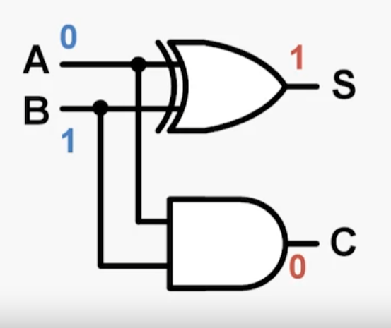
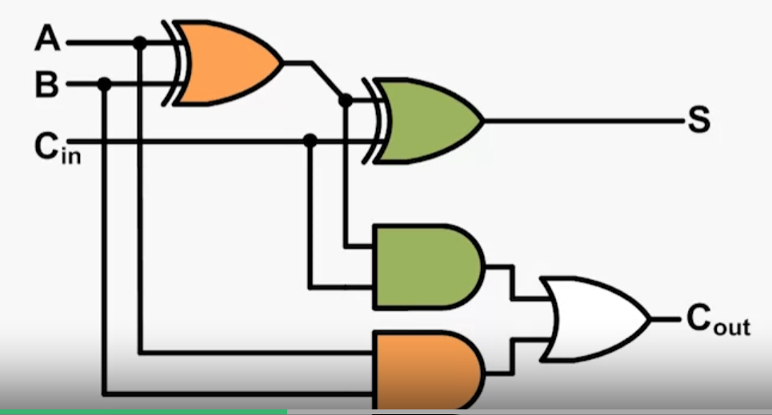
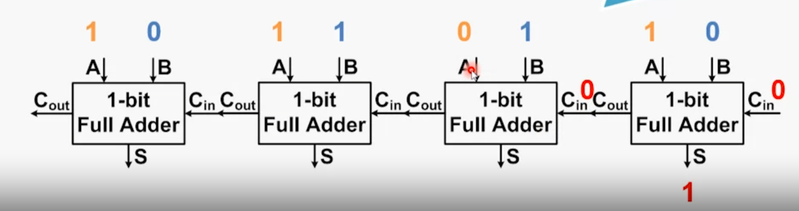
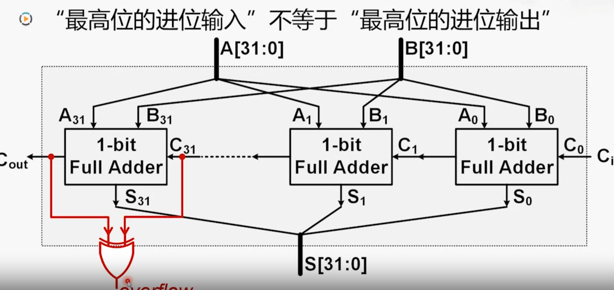
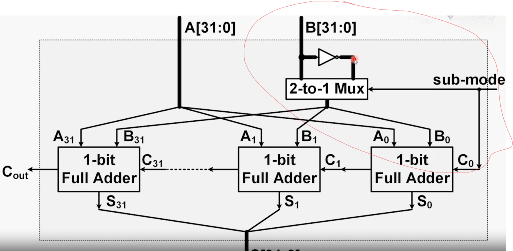
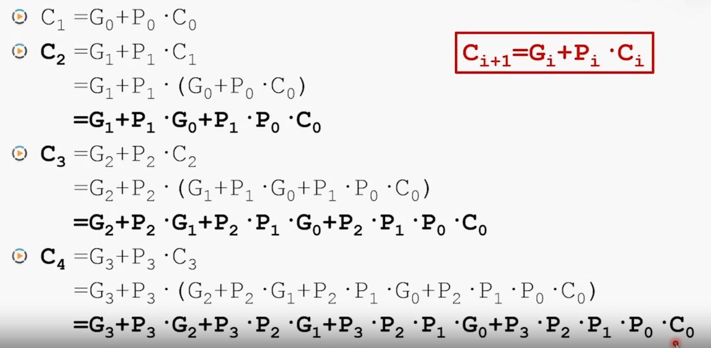
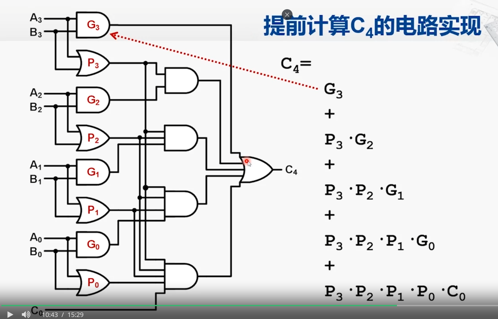
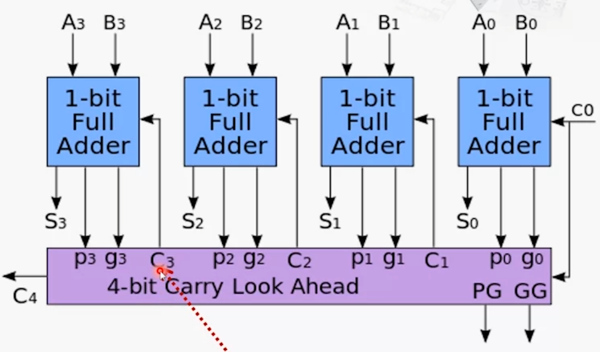
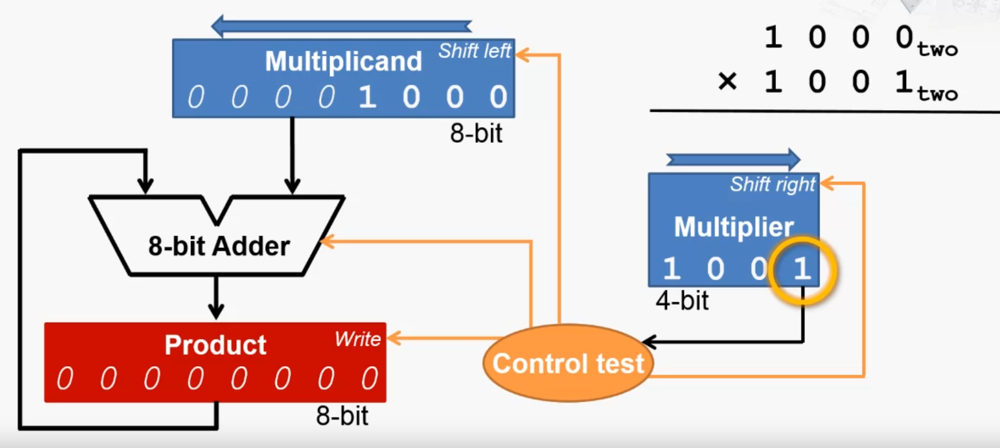

[toc]
# 算术运算的实现

## 加减法运算实现

### 半加器

半加器原理

A与B经过异或门产生输出，经过与门产生进位。

半加器无法处理进位，通过使用两个半加器就可以实现全加器，处理进位。

全加器原理

### 行波进位加法器（Ripple-Carry Adder,RCA）

通过全加器串联得到行波进位加法器

### 加法进位溢出

**最高位的进位输入不等于最高位的进位输出就代表溢出**

### 减法运算

减法运算在加法运算中加入了一个取反的操作，并且在最初的$C_0$进位标志符设为1，

### 超前进位加法器（Carry-Lookahead Adder）

行波进位加法器电路实现简单，但是由于只有当前一位的进位计算出来之后才能计算后一位的结果，因此，计算效率很低。考虑设计一个能够提前计算出进位量的加法器。

推导过程
$$
\begin{aligned}

+ &: 代表或运算\\
*&:代表与运算\\
A_i&:数A的第i位\\
B_i&:数B的第i位\\
C_i&:第i-1位的参数的进位参与i位运算
\end{aligned}
$$
$$
\begin{aligned}
C_i &= (A_i*B_i)+(A_i*C_i)+(B_i*C_i)\\   
    &=(A_i*B_i)+(A_i+B_i)*C_i \qquad  &\qquad(提取出 C_i)\\
    \\
    令G_i = A_i * B_i ,P_i = A_i + B_i\\
    可以得到以下推理:\\
    C_{i+1} &= G_i+ P_i* C_i\\
    我们可以将C_i逐层展开：
\end{aligned}
$$

因此根据推理，我们可以设计出这样的电路：

CLA实现

### CLA实现

### 效率分析
假定通过每一个电子元件所需要的时间为 T

- 对于行波进位加法器,所需要的时间是线性叠加的，总时间为$T_{total} = (2n+1)*T$其中n为加法位数。
- 对于CLA，我们由推到公式和框图可以指导，最多需要通过4个元件，因此为 $4T$，不随位数增长。

- 但是由于CLA的线路实现过于复杂，因此，实际中常常是多个位数小的CLA通过RCA的方式串联而成。

## 乘法运算

### 乘法运算过程
乘法过程中主要维护三个变量：被乘数、乘数和部分积（最初为0）
按照以下过程进行计算：
1. 判断乘数的最后一位是否为1，如果是，部分积加上被乘数
2. 被乘数左移一位。
3. 乘数右移一位，注意是逻辑右移。
4. 循环步骤一，直到乘数所有位都为0，此时部分积就是结果。

###  乘法器的实现

乘法器的实现

控制逻辑实现了上述的步骤。