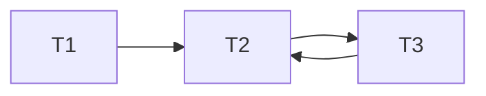
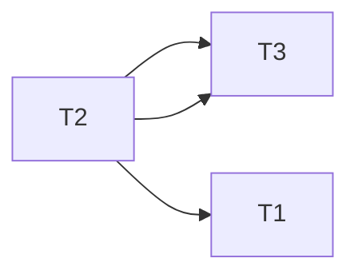

# 一、

## 1、

- R 有 20000 个元组，一块可以容纳 20 个 R 元组，因此 R 需要 20000 / 20 = 1000 个磁盘块。
- S 有 60000 个元组，一块可以容纳 30 个 S 元组，因此 S 需要 60000 / 30 = 2000 个磁盘块。

对于嵌套循环连接来说，基本的 I/O 成本可以通过以下方式计算：

- 对于 R 中的每一个块，我们需要把它读入内存，这将消耗 R 的块数（1000）次 I/O。
- 对于 R 中的每一个块，我们需要扫描整个 S，这将消耗 R 的块数（1000）* S 的块数（2000）次 I/O。
  因此，总的 I/O 成本就是 R 的块数 + R 的块数 * S 的块数 = 1000 + 1000 * 2000 = 2001000 次 I/O。

## 2.

- R 有 20000 个元组，一块可以容纳 20 个 R 元组，因此 R 需要 20000 / 20 = 1000 个磁盘块。
- S 有 60000 个元组，一块可以容纳 30 个 S 元组，因此 S 需要 60000 / 30 = 2000 个磁盘块。

在归并连接中，需要对 R 和 S 做一次完整的扫描以进行比较和连接。所以总的 I/O 次数包括读取 R 和 S 的所有块
归并连接的 I/O 成本可以用以下公式计算：
I/O(R⨝S) = (I/O(R) + I/O(S))
总的 I/O 成本就是 (1000 + 2000) = 3000 次 I/O。

## 3、

- R 有 20000 个元组，一块可以容纳 20 个 R 元组。
- S 有 60000 个元组，一块可以容纳 30 个 S 元组。

在自然连接 R ⨝ S 中，每个 R 的元组将与 S 中匹配的元组连接起来。由于 R.B 是 R 的外键，参照 S.B，因此 R 和 S 在 B 上的值应该是一一对应的，也就是说，R ⨝ S 的结果应该有 20000 个元组（即 R 的元组数量）。

由于 R ⨝ S 的结果中元组的平均大小是 R 中元组平均大小的 1.2 倍，因此一个块可以容纳的 R ⨝ S 的元组数量应该是 R 的元组数量的 1 / 1.2 = 5 / 6。因此，一个块可以容纳 20 * (5 / 6) = 16.67 个 R ⨝ S 的元组。向上取整，我们认为一个块可以容纳 17 个 R ⨝ S 的元组。

那么，R ⨝ S 的结果应该需要 20000 / 17 = 1176.47 块。向上取整，我们需要 1177 块来存储 R ⨝ S 的结果。

# 二、

## 1、

- R 有 1000 个元组，每个块可以容纳 20 个 R 元组，因此 R 需要 1000 / 20 = 50 个块。
- S 有 1500 个元组，每个块可以容纳 30 个 S 元组，因此 S 需要 1500 / 30 = 50 个块。
- S 中 Y 不同值的个数为 20，平均每个 Y 值有 1500 / 20 = 75 个元组。

在索引连接中，对于 R 中的每个元组 r，我们都需要在 S 中查找与之匹配的元组 s。由于 S 中有聚簇索引，我们可以通过索引直接定位到所需的块，从而减少 I/O 的次数。

对于每个 r，我们需要做以下操作：

1. 通过索引查找对应的 s，假设索引查找需要一次 I/O。
2. 读取 S 中与 r 匹配的所有元组，平均需要 75 / 30 = 2.5 块，向上取整，我们认为需要 3 次 I/O。

所以，对于每个 r，我们总共需要 1 + 3 = 4 次 I/O。

因此，对于所有的 R，我们需要的 I/O 代价是 R 的元组数量 * 每个元组的 I/O 代价 = 1000 * 4 = 4000 次 I/O。

## 2.

- R 有 1000 个元组，每个块可以容纳 20 个 R 元组，因此 R 需要 1000 / 20 = 50 个块。
- S 有 1500 个元组，每个块可以容纳 30 个 S 元组，因此 S 需要 1500 / 30 = 50 个块。
- S 中 Y 不同值的个数为 20，平均每个 Y 值有 1500 / 20 = 75 个元组。

在非聚簇索引连接中，对于 R 中的每个元组 r，我们都需要在 S 中查找与之匹配的元组 s。由于 S 中有非聚簇索引，我们可以通过索引直接定位到所需的元组，但是因为非聚簇索引并不保证物理存储的顺序，可能需要更多的 I/O 次数。

对于每个 r，我们需要做以下操作：

1. 通过索引查找对应的 s，假设索引查找需要一次 I/O。
2. 读取 S 中与 r 匹配的所有元组。由于这是非聚簇索引，每个元组可能都在不同的块中，因此需要 75 次 I/O。

所以，对于每个 r，我们总共需要 1 + 75 = 76 次 I/O，但是由于75>50,所以可以直接将S中的元素加载进入，所以最多需要51次。

因此，对于所有的 R，我们需要的 I/O 代价是 R 的元组数量 * 每个元组的 I/O 代价 = 1000 * 51 = 51000 次 I/O。

# 三、

## 1.

$$
\pi_{sname}(\sigma_{Cname='数据库'(S\Join SC \Join C)})
$$

## 2.

对应的查询计划树为：

```
          π_SNAME
             |
         σ_CNAME="数据库"
             |
          ⨝_C.C#=SC.C#
         /          \
 ⨝_S.S#=SC.S#        C
 /         \
S           SC
```

然后，我们使用启发式查询优化算法对这个查询计划树进行优化。一般的启发式查询优化策略包括将选择操作和投影操作尽可能地推向查询树的叶节点，以及将小的关系放在连接操作的左边。

在这个查询计划树中，选择操作已经尽可能地接近叶节点。投影操作无法进一步向下推，因为它依赖于连接操作的结果。然而，我们可以优化连接操作的顺序。

假设 S, SC 和 C 的元组数量分别为 |S|, |SC| 和 |C|，我们不知道这些值，但是我们可以假设 |S| < |SC| < |C|，因为一位学生可以选择多门课程，一门课程可以被多位学生选择。所以，我们将连接操作的顺序改为先连接 S 和 SC，然后再连接结果和 C。

优化后的查询计划树为：

```
          π_SNAME
             |
          ⨝_C.C#=SC.C#
         /          \
    σ_CNAME="数据库"  C
         |
      ⨝_S.S#=SC.S#
     /         \
    S           SC
```

在这个优化后的查询计划树中，我们先执行 S 和 SC 的连接操作，然后执行选择操作，最后再执行与 C 的连接操作和投影操作。这样，我们可以尽早地过滤掉不满足条件的元组，减少后续操作的复杂性。

## 3.

对于优化前的查询计划：

1. `⨝_S.S#=SC.S#`：S 表与 SC 表自然连接，假设每一条 S 表的元组都能在 SC 表中找到匹配，那么中间结果的大小应该是 SC 表的大小，即 10000 条元组。
2. `⨝_C.C#=SC.C#`：上述连接结果与 C 表自然连接，由于 C 表的主键 C# 也是 SC 表的外键，同样假设每一条上述连接的结果都能在 C 表中找到匹配，那么中间结果的大小应该仍然是 10000 条元组。
3. `σ_CNAME="数据库"`：对上述连接结果进行选择操作，只保留 CNAME 为 "数据库" 的元组，根据题目给出的数据，这样的元组有 150 条。

对于优化后的查询计划：

1. `⨝_S.S#=SC.S#`：这一步与优化前的查询计划中的第一步相同，中间结果的大小应该是 10000 条元组。
2. `σ_CNAME="数据库"`：对 SC 表进行选择操作，只保留选修了 "数据库" 课程的元组，这样的元组有 150 条。
3. `⨝_C.C#=SC.C#`：上述选择结果与 C 表自然连接，每一条选择结果都能在 C 表中找到匹配（因为选择结果是根据 CNAME 从 SC 表中选择出来的），那么中间结果的大小应该是 150 条元组。

通过比较可以看出，优化后的查询计划在连接操作的中间结果大小上有显著的优势，能够更有效地减少计算和存储的开销。

# 四、

## 1、

```
                π_C.type
                   |
                σ_R.name='Tutu' ∧ C.weight>100 ∧ C.weight<500
                   |
                ⨝_R.rid=A.rid ∧ C.cid=A.cid
               /        |        \
             R         A         C

```

## 2、

```
            π_C.type
               |
            ⨝_C.cid=A.cid
           /          \
 σ_C.weight>100 ∧ C.weight<500 C     A
           |
       ⨝_R.rid=A.rid
      /         \
σ_R.name='Tutu'  R
```

# 五、

## 1、

```
         π_bname
            |
         σ_date='2021-06-04' ∧ dept='CS'
            |
     B ⨝_bno=bno ⨝_sno=sno S ⨝_sno=sno L

```

## 2、

```
                       Join (Natural Join) 
                      /                 \   
                 B                    Join (Natural Join)
                                /                    \  
                             S                        L
                          /     \                      \
                        sigma_ dept = "CS"             data = "2021-06-04"
```

将选择向下推移，从而减少了进行自然连接的元组的数量。

# 六、

## 1、
需要构建冲突图（或预写读图）来判断给定的调度是否可串行化。在冲突图中，节点代表事务，边代表冲突。如果事务 Tj 读取或写入了事务 Ti 更改过的数据项，那么在 Ti 和 Tj 之间存在一条边。如果这个图中不存在环，那么这个调度就是冲突可串行化的。

首先，我们根据给定的调度序列创建冲突图：

1. 由于 T2 在 T3 之前写了 A，所以有一条从 T2 到 T3 的边。
2. 由于 T1 在 T2 之前写了 B，并且 T2 之后读了 B，所以有一条从 T1 到 T2 的边。
3. 由于 T3 在 T2 之前读了 A，并且 T2 之后写了 A，所以有一条从 T3 到 T2 的边。



可以看到存在一个环（T2 --> T3 --> T2），所以这个调度是不可串行化的。

## 2.
使用冲突图来确定给定的调度是否可串行化。
根据给定的调度序列，可以构建冲突图：

1. 由于T2在T3之前写了A，所以有一条从T2到T3的边。
2. 由于T1在T2之后写了B，并且T2先读了B，所以有一条从T2到T1的边。
3. 由于T3在T2之后写了A，并且T2先读了A，所以有一条从T2到T3的边。


可以看到没有循环，因此这个调度是可串行化的。

# 七、

## 1、
两段锁协议（Two-Phase Locking, 2PL）是一种用于保证并发控制的锁协议。它分为两个阶段：加锁阶段和解锁阶段。在加锁阶段，事务可以请求并获取所需的锁，但不能释放任何锁；在解锁阶段，事务可以释放锁，但不能请求新的锁。这样可以确保事务在执行过程中，其他事务不会对已锁定的资源进行修改，从而保证了数据的一致性。
```
T1:
lock(A);
read(A);
lock(B);
read(B);
if A > B then B := A;
unlock(A);
unlock(B);

T2:
lock(B);
read(B);
lock(A);
read(A);
if B < 0 then A := B * B;
unlock(B);
unlock(A);
```

## 2、
```
T1: lock(A);
T1: read(A);
T1: lock(B);
T2: (等待 B 的锁)
T1: read(B);
T1: if A > B then B := A; 
T1: unlock(A);
T1: unlock(B);
T2: (获取 B 的锁)
T2: read(B);
T2: lock(A);
T2: read(A);
T2: if B < 0 then A := B * B;
T2: unlock(B);
T2: unlock(A);
```

## 3、
死锁是指两个或多个事务在执行过程中，因争夺资源而造成的一种僵局（即每个事务都在等待对方释放其所占用的资源），如果系统对资源的分配策略不合理，那么就可能发生死锁。

如果 T1 和 T2 同时运行并且他们尝试同时锁定变量 A 和 B，但是以不同的顺序进行，那么就可能发生死锁。
```
T1: lock(A);
T1: read(A);
T2: lock(B);
T2: read(B);
T1: (尝试锁定 B，但 B 已被 T2 锁定，所以 T1 阻塞等待)
T2: (尝试锁定 A，但 A 已被 T1 锁定，所以 T2 阻塞等待)
```
在这个调度中，T1 首先锁定了 A，然后读取了 A。同时，T2 锁定了 B，然后读取了 B。然后，T1 尝试锁定 B，但 B 已被 T2 锁定，所以 T1 被阻塞。同样，T2 尝试锁定 A，但 A 已被 T1 锁定，所以 T2 也被阻塞。此时，T1 和 T2 都在等待对方释放其锁定的资源，形成了死锁。

## 4、
资源分配图（Resource Allocation Graph，RAG）是一种常用的死锁检测方法。资源分配图是一个有向图，其中节点代表事务和资源，边代表请求和分配。

在这个图中：

- 圆形节点表示事务，矩形节点表示资源。
- 如果一个事务请求一个资源，那么会有一条从事务节点指向资源节点的边，这叫做请求边。
- 如果一个资源被一个事务占用，那么会有一条从资源节点指向事务节点的边，这叫做分配边。

根据资源分配图，我们可以检测是否存在死锁。如果在资源分配图中存在一个或多个环，那么就存在死锁。因为如果存在环，那么就意味着有一些事务在等待一个已经被其他在环中的事务持有的资源，这就形成了死锁。
为了避免死锁，我们可以使用一些策略，比如让所有的事务都按照一定的顺序请求资源。例如，我们可以规定所有的事务都先请求资源 A，再请求资源 B，这样就不会出现环，也就不会有死锁。

# 八、

## 1、
该数据库系统的日志恢复策略是 Undo/Redo 型，那么其对应的缓冲区处理策略通常是 Write-Ahead Logging (WAL) 策略。该策略的主要内容如下：

1. 日志记录先行原则：在任何更新的页面被实际写入磁盘之前，所有这些更新的日志记录（包括对应的 redo 和 undo 信息）必须先写入日志并持久化。这个原则是为了确保在发生故障时，对所有已提交事务的更改都有足够的信息来重做它们，以及对所有未提交事务的更改都有足够的信息来撤销它们。

2. 日志持久化原则：在事务提交之前，必须确保该事务的所有日志记录已经被写入并持久化。这是为了确保即使在事务提交直后系统发生故障，也有足够的信息来重做所有已提交事务的更改。

3. 顺序写入原则：日志记录必须按照它们生成的顺序写入日志。这样可以优化磁盘 I/O，因为写入磁盘通常在顺序进行时效率最高。

在该策略下，数据库管理系统（DBMS）在发生故障并重启后，会读取 WAL 日志并进行故障恢复。首先，它会进行 redo 操作，从日志的开始到结束按顺序将所有事务的更改重做一遍，即使这些事务最后可能被撤销。然后，它会进行 undo 操作，从日志的结束到开始按逆序将所有未完成（即未提交或者在提交时发生故障）的事务的更改撤销。这样可以保证在故障后，数据库可以恢复到一个一致且所有已提交事务的更改都被保留的状态。

## 2、
DBMS会对所有的事务T1、T2 和 T3进行redo操作。undo操作则只会对T2和T3进行。
具体的过程如下：

1. Redo：DBMS会从头开始读取日志，按照日志中记录的顺序将每个事务所做的修改重新应用到数据库中。即使这些修改最后可能会被undo操作撤销，DBMS也会先将它们redo。在这个例子中，DBMS会先将T1的修改redo，然后是T2的修改，最后是T3的修改。

2. Undo：DBMS会从尾部开始读取日志，找到那些没有"commit"的事务，然后按照日志中记录的逆序将这些事务所做的修改撤销。在这个例子中，DBMS会先找到T2和T3，然后先将T3的修改撤销，然后是T2的修改。

这样，DBMS就可以保证在故障发生后，数据库可以恢复到一个一致的状态，所有已经完成的事务的修改都被保留，而所有未完成的事务的修改都被撤销。

## 3、
在故障恢复时，DBMS 会先进行 redo 操作，然后进行 undo 操作。

1. Redo 操作：DBMS 会按照日志中的顺序，将所有事务的操作再执行一遍。这就意味着，A 先被改为 114514，然后再被改为 1919810；B 先被改为 "hitcs"，然后再被改为 "hitcsdb"。

2. Undo 操作：DBMS 会按照日志中的逆序，将未完成事务（即 T2 和 T3）的操作撤销。这就意味着，A 被 T2 的修改撤销，恢复为 114514；B 被 T3 的修改撤销，恢复为 "hitcs"。

所以，当故障恢复完成时，对象 A 的值是 114514，对象 B 的值是 "hitcs"。

# 九、
 
## 1、
$T_3,T_5$重做，$T_2$需要撤销，其他不需要操作。

## 2、
- 事务𝑇6 在发生故障前已经提交，所以不需要进行undo操作，但需要进行redo操作以保证其持久性。
- 事务𝑇7 和 𝑇8 在故障发生时还未提交，所以需要进行undo操作。但是，因为它们的操作在checkpoint之后，所以也需要进行redo操作。

需要undo的事务列表：𝑇7，𝑇8
需要redo的事务列表：𝑇6，𝑇7，𝑇8

## 3、
恢复过程分为两个阶段：Analysis和Recovery。

1. **Analysis** 阶段：

   在这个阶段，我们需要确定那些事务在检查点（checkpoint）时正在执行，以及那些事务在故障发生时仍在执行。从日志中我们可以看出，事务𝑇6、𝑇7 和 𝑇8 在检查点时正在执行，且𝑇7 和 𝑇8 在故障发生时仍在执行。

2. **Recovery** 阶段：

   在这个阶段，我们需要进行undo和redo操作：

   - **Redo**：从检查点开始，对所有的事务（包括已提交的事务𝑇6 和未提交的事务𝑇7 和 𝑇8）重做所有的操作。这是因为我们不能保证在检查点后的修改是否已经写入到了硬盘中。根据日志，我们可以看到事务𝑇6 的修改是X的值从100变为1，事务𝑇7 的修改是X的值从1变为3，Y的值从50变为6，事务𝑇8 的修改是Y的值从6变为8，Z的值从10变为9和9变为10。
   - **Undo**：对在故障发生时仍未提交的事务进行撤销，𝑇7 和 𝑇8。我们需要将事务𝑇7 的修改撤销，即将X的值从3变回1，将Y的值从6变回50，同时将事务𝑇8 的修改撤销，即将Y的值从8变回6，将Z的值从10变回9。

