<font face="宋体">

# 进程


## 进程的创建

### UNIX
    UNIX只能采用fork创建进程，进程具有先沟通的存储映像、环境字符串和打开的文件描述符。

### Windows
    Windows 采用Win32函数调用CreateProcess既处理进程的创建也执行execve的函数。CreateProcess由10个参数，包含了命令参数、安全属性和文件继承控制、优先级等多种信息。

进行创建之后，父进程和子进程具有不同的地址空间。对于UNiX而言，父子进程再不可写的内存区是共享的（因此，可以共享一些资源），Windows中父子地址空间在创建之后就不同。

## 进程的层次结构

### UNIX

    在UNIX中，进程和它的所有子女以及后裔共同组成一个进程组。当用户从键盘发出一个信号时，该信号被送给当前与键盘相关的进程组中的所有成员（它们通常是在当前窗口创建的所有活动进程）。每个进程可以分别捕获该信号、忽略该信号或采取默认的动作，即被该信号杀死

### Windows
    Windows中没有进程层次的概念，所有的进程都是地位相同的。惟一类似于进程层次的暗示是在创建进程的时侯，父进程得到一个特别的令牌（称为句柄），用来控制子进程。但是，它有权把这个令牌传送给某个其他进程，这样就不存在进程层次了。在UNIX中，进程就不能剥夺其子女的“继承权”。


## 进程的状态


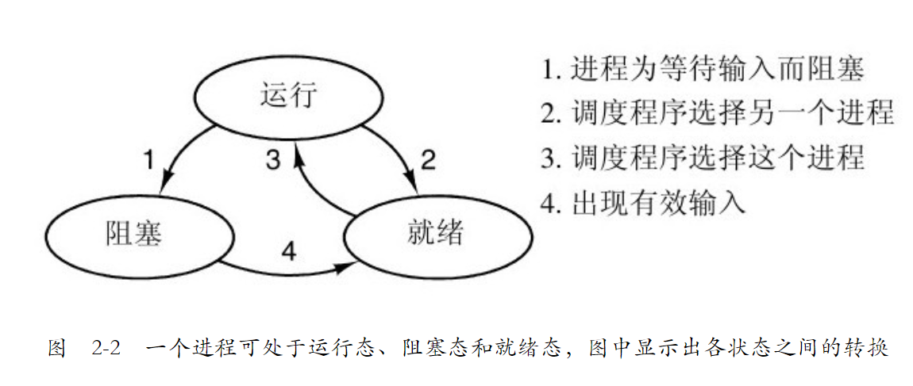

1. 进程可以使用wait类函数从运行态变为阻塞态
2. 操作系统的调度程序可以是进程由运行态转变为就绪态
3. 操作系统的调度程序可以是进程由就绪态转变为运行态
4. 阻塞的程序在接收到信号之后，可以由阻塞态变为就绪态，但不可以直接变为运行态。

### 进程的数据结构和调度

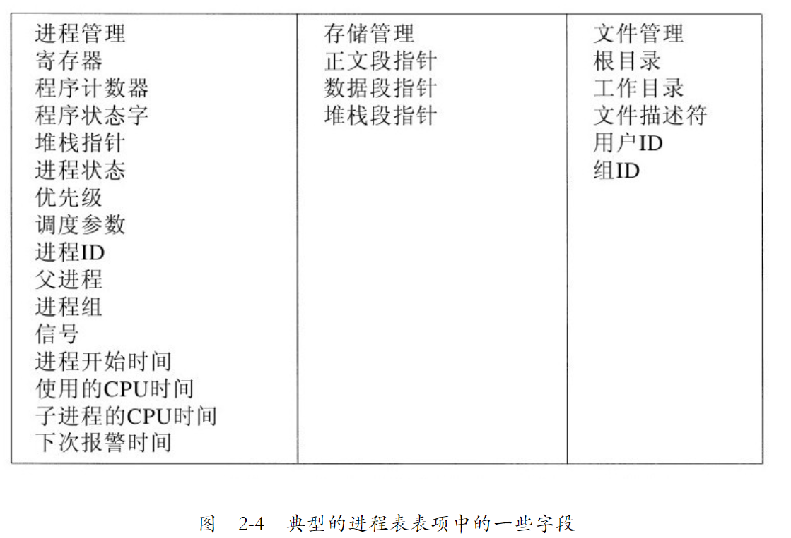

操作系统维护了一张进程表包含了上述的信息。

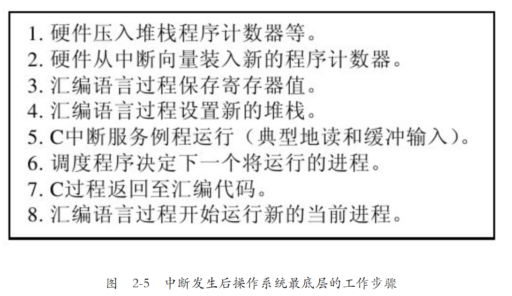


操作系统在指令的中断周期执行进程的切换。


# 线程

**线程可以看作简单的进程，线程的创建快速、简单，并且线程之间共享所有的地址空间、打开文件集、子进程、报警以及相关信号等**

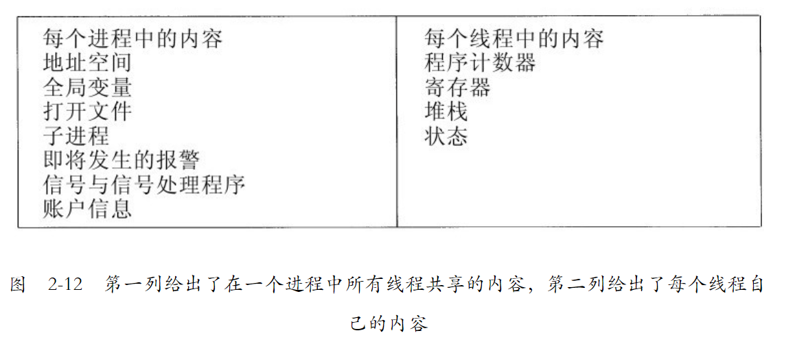

需要注意的是每个线程拥有独立的堆栈（这样才能独立执行函数）。

## 主要的线程函数（Pthread库）

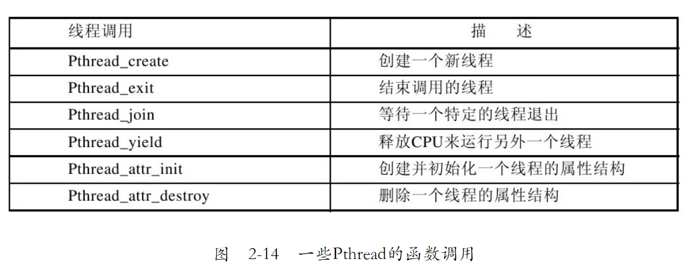


## 线程的实现

线程的实现主要分为三种情况：用户程序管理、内核管理和综合管理


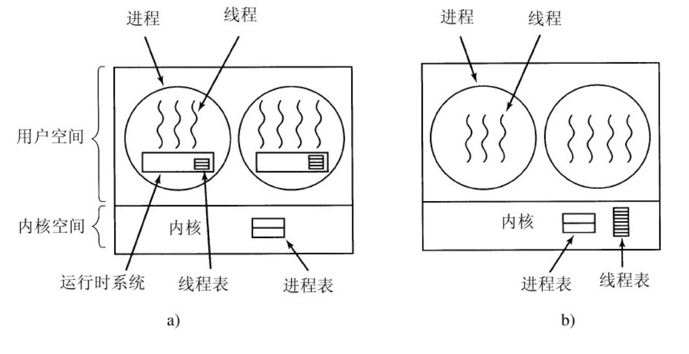


### 用户程序管理

    把整个线程包放在用户空间中，内核对线程包一无所知。从内核角度考虑，就是按正常的方式管理，即单线程进程。这种方法第一个，也是最明显的优点是，用户级线程包可以在不支持线程的操作系统上实现。
    缺点：对于线程的切换很不方便；如果线程因系统调用而进入trap，那么内核很难对线程进行处理（可能会阻塞该进程的所有线程），例如缺页故障。

### 内核进行管理

    每个进程中也有线程表，在内核中有用来记录系统中所有线程的线程表。
    内核的线程表保存了每个线程的寄存器、状态和其他信息。内核线程不需要任何新的、非阻塞系统调用。另外，如果某个进程中的线程引起了页面故障，内核可以很方便地检查该进程是否有任何其他可运行的线程，如果有，在等待所需要的页面从磁盘读入时，就选择一个可运行的线程运行。这样做的主要缺点是系统调用的代价比较大，所以如果线程的操作（创建、终止等）比较多，就会带来很大的开销。

> 一些问题: 
> 
>   1. 当一个多线程进程创建新的进程时，会发生什么？新进程是拥有与原进程相同数量的线程，还是只有一个线程？
>   2. 信号是发给进程而不是线程的.当一个信号到达时，应该由哪一个线程处理它？线程可以“注册”它们感兴趣的某些信号，因此当一个信号到达的时候，可把它交给需要它的线程。但是如果两个或更多的线程注册了相同的信号，会发生什么？


### 混合管理
略


# 进程间通信

主要是解决三个问题：
1. 进程如何进行信息传递
2. 进行如何处理竞争（进程之间的交互）。例如，在飞机订票系统中的两个进程为不同的客户试图争夺飞机上的最后一个座位。
3. 如何处理进行通信顺序。如果进程A产生数据而进程B打印数据，那么B在打印之前必须等待，直到A已经产生一些数据。

对于线程来说，线程间的通信也是要解决这样的问题。对于线程，问题一因为共享地址空间所以很好解决。问题二、三线程和进程由相似的解决方法。

## 竞争条件

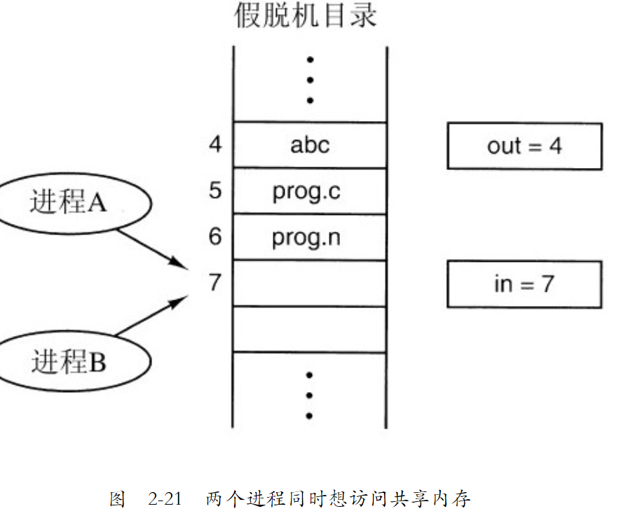

对于任何被所进程共享的资源（共享内存、文件等），都有可能发生这样的一种情况：
> 1. 进程A访问了占位符为7的文件，并存储在fileA，并且在更新文件之前，进行步骤2
> 2. CPU进行了进程切换，切换为B，
> 3. 进程B也读取了占位符7，并将文件写入到占位符为7的位置
> 4. CPU切换为进程A，A查看已经读取的文件占位符fileA，将文件写入到7.

这样B所要存储的文件就会被A进程文件覆盖，从而产生错误。

## 临界区

要避免竞争，就需要对进程设置边界条件，使得他们满足下面四个条件：

    1. 任何两个进程不能同时处于其临界区。
    2. 不应对CPU的速度和数量做任何假设。
    3. 临界区外运行的进程不得阻塞其他进程。
    4. 不得使进程无限期等待进入临界区。

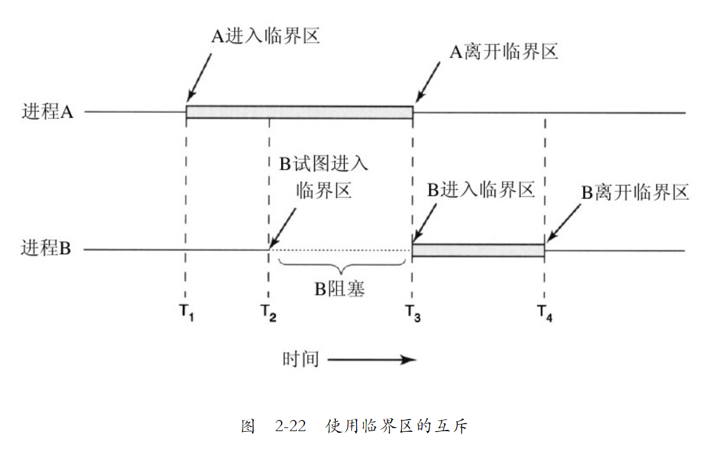


设置临界区的本质就是实现互斥。

## 互斥的设置方法

### 屏蔽中断

每个进程在刚刚进入临界区后立即屏蔽所有中断，并在就要离开之前再打开中断。

    这个方案目前越来越少被考虑，因为
    1. 把屏蔽中断的权力交给用户进程是不明智的。用户程序可能永远不打开中断。
    2. 屏蔽中断仅仅对执行disable指令的那个CPU有效。其他CPU仍将继续运行，并可以访问共享内存。

### Peterson解法

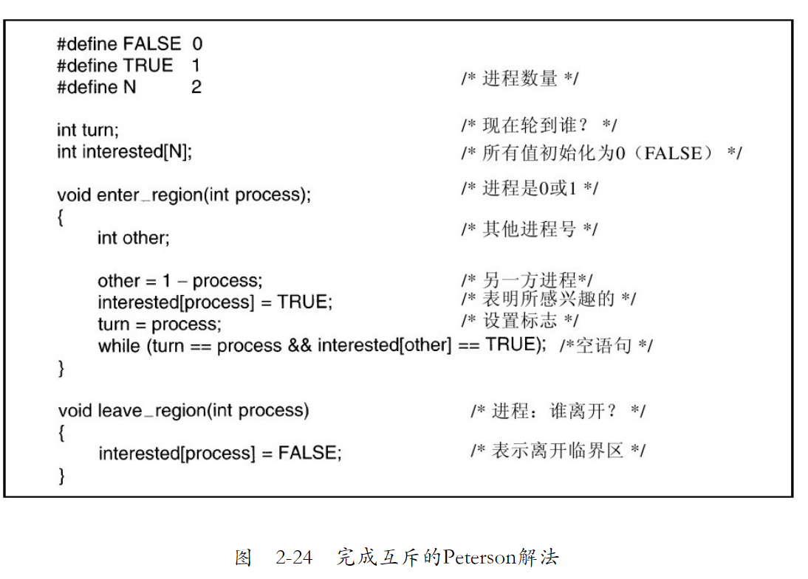

```c
#define FALSE 0
#define TRUE 1
#define N 2
int turn;
int interested[N];
void enter_region(int process)
{
	int other = 1 - process;
	interested[process] = TRUE;
	turn = process;
	while (other == process && interested[other] == TRUE);

}
void leave_region(int process)
{
	interested[process] = FALSE;
}
```

    一开始，没有任何进程处于临界区中，现在进程0调用enter_region。它通过设置其数组元素和将turn置为0来标识它希望进入临界区。由于进程1并不想进入临界区，所以enter_region很快便返回。如果进程1现在调用enter_region，进程1将在此处挂起直到interested[0]变成FALSE，该事件只有在进程0调用leave_region退出临界区时才会发生。

    现在考虑两个进程几乎同时调用enter_region的情况。它们都将自己的进程号存入turn，但只有后被保存进去的进程号才有效，前一个因被重写而丢失。假设进程1是后存入的，则turn为1。当两个进程都运行到while语句时，进程0将循环0次并进入临界区，而进程1则将不停地循环且不能进入临界区，直到进程0退出临界区为止。

### TSL、XCHG指令

可以通过添加新的汇编指令，并且设置新的硬件机制来解决这个问题。

> TSL RX,LOCK

该指令是测试并加锁（Test and Set Lock）的简写，它将一个内存字lock读到寄存器RX中，然后在该内存地址上存一个非零值。读字和写字操作保证是不可分割的，即该指令结束之前其他处理器均不允许访问该内存字。执行TSL指令的CPU将锁住内存总线，以禁止其他CPU在本指令结束之前访问内存。


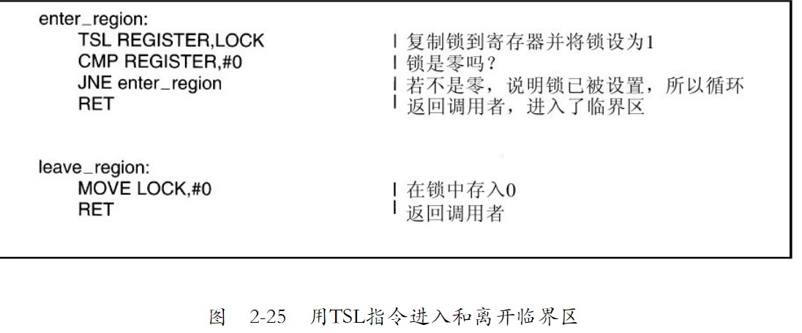

通过锁住数据总线来达到对所有CPU（除了设置该锁的CPU）禁止访问内存的作用，修改共享变量。


### 生产者和消费者问题——信号量


生产者和消费者问题：两个进程共享一个公共的固定大小的缓冲区。其中一个是生产者，将信息放入缓冲区；另一个是消费者，从缓冲区中取出信息。（可以拓展到m个生产者，n个消费者）

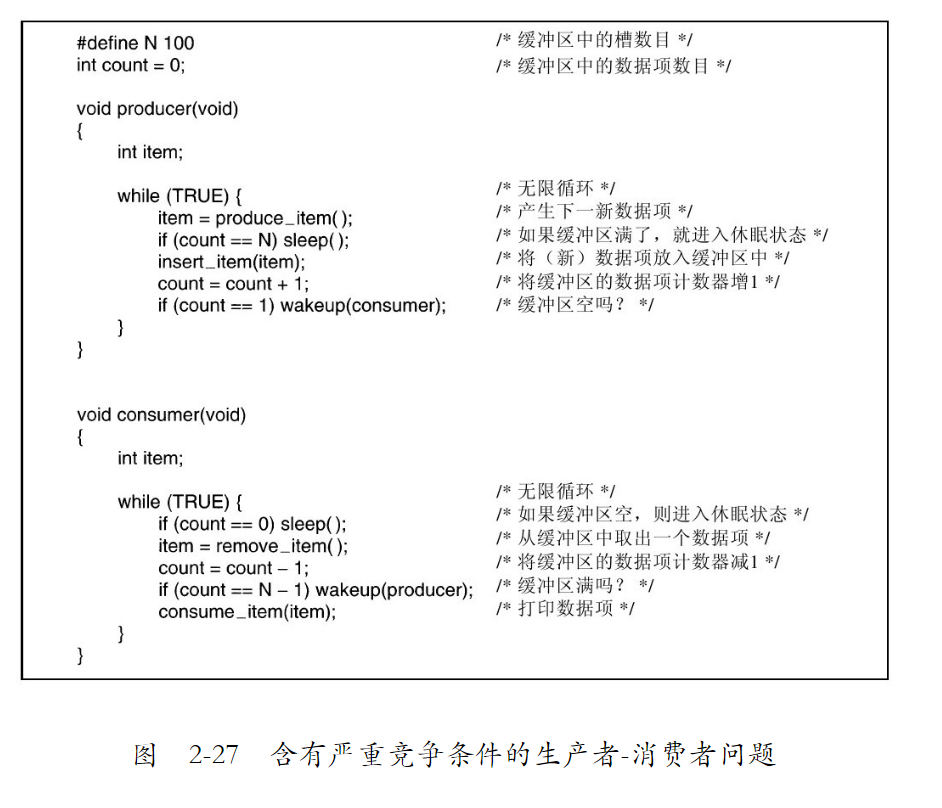

这里会出现竞争条件，其原因是对count的访问未加限制。有可能出现以下情况：缓冲区为空，消费者刚刚读取count的值发现它为0。此时调度程序决定暂停消费者并启动运行生产者。生产者向缓冲区中加入一个数据项，count加1。现在count的值变成了1。它推断认为由于count刚才为0，所以消费者此时一定在睡眠，于是生产者调用wakeup来唤醒消费者。

但是，消费者此时在逻辑上并未睡眠，所以wakeup信号丢失。当消费者下次运行时，它将测试先前读到的count值，发现它为0，于是睡眠。生产者迟早会填满整个缓冲区，然后睡眠。这样一来，两个进程都将永远睡眠下去。

**问题的实质在于发给一个（尚）未睡眠进程的wakeup信号丢失了。如果它没有丢失，则一切都很正常**


**使用一个整型变量来累计唤醒次数，供以后使用。在他的建议中引入了一个新的变量类型，称作信号量（semaphore）。一个信号量的取值可以为0（表示没有保存下来的唤醒操作）或者为正值（表示有一个或多个唤醒操作）。**

发明信号量提出两个操作：
   1. down。对一信号量执行down操作，则是检查其值是否大于0。若该值大于0，则将其值减1（即用掉一个保存的唤醒信号）并继续；若该值为0，则进程将睡眠，而且此时down操作并未结束。检查数值、修改变量值以及可能发生的睡眠操作均作为一个单一的、不可分割的原子操作完成。保证一旦一个信号量操作开始，则在该操作完成或阻塞之前，其他进程均不允许访问该信号量。
   2. up.up操作对信号量的值增1。如果一个或多个进程在该信号量上睡眠，无法完成一个先前的down操作，则由系统选择其中的一个（如随机挑选）并允许该进程完成它的down操作。于是，对一个有进程在其上睡眠的信号量执行一次up操作之后，该信号量的值仍旧是0，但在其上睡眠的进程却少了一个。信号量的值增1和唤醒一个进程同样也是不可分割的。不会有某个进程因执行up而阻塞，正如在前面的模型中不会有进程因执行wakeup而阻塞一样。

为确保信号量能正确工作，最重要的是要采用一种不可分割的方式来实现它。

### 信号量-> 互斥量

如果不需要信号量的计数能力，有时可以使用信号量的一个简化版本，称为互斥量（mutex）。

互斥量是一个可以处于两态之一的变量：解锁和加锁。这样，只需要一个二进制位表示它，不过实际上，常常使用一个整型量，0表示解锁，而其他所有的值则表示加锁。互斥量使用两个过程。当一个线程（或进程）需要访问临界区时，它调用mutex_lock。如果该互斥量当前是解锁的（即临界区可用），此调用成功，调用线程可以自由进入该临界区。

另一方面，如果该互斥量已经加锁，调用线程被阻塞，直到在临界区中的线程完成并调用mutex_unlock。如果多个线程被阻塞在该互斥量上，将随机选择一个线程并允许它获得锁。

### Pthread相关的函数

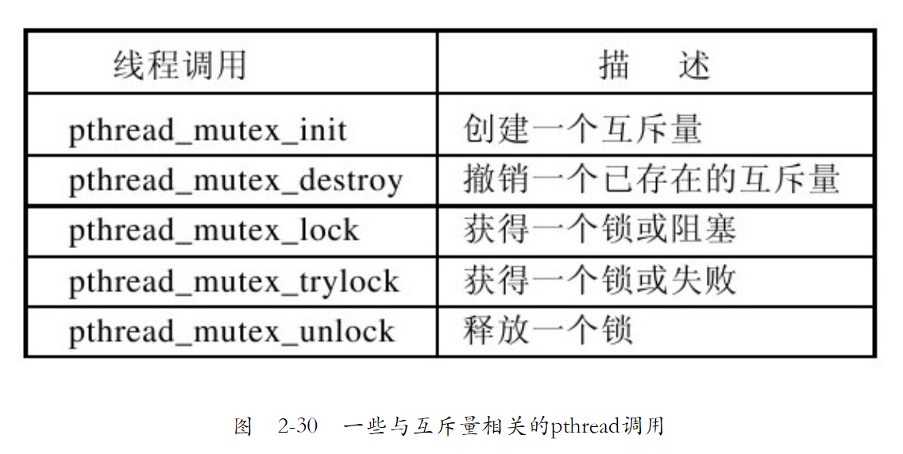

除互斥量之外，pthread提供了另一种同步机制：条件变量。互斥量在允许或阻塞对临界区的访问上是很有用的，条件变量则允许线程由于一些未达到的条件而阻塞。
    考虑一下生产者-消费者问题：一个线程将产品放在一个缓冲区内，由另一个线程将它们取出。如果生产者发现缓冲区中没有空槽可以使用了，它不得不阻塞起来直到有一个空槽可以使用。生产者使用互斥量可以进行原子性检查，而不受其他线程干扰。但是当发现缓冲区已经满了以后，生产者需要一种方法来阻塞自己并在以后被唤醒。这便是条件变量做的事了。

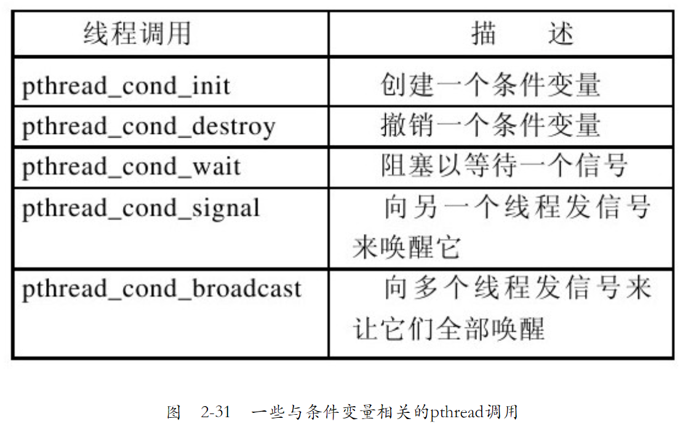

条件变量与互斥量经常一起使用。这种模式用于让一个线程锁住一个互斥量，然后当它不能获得它期待的结果时等待一个条件变量。最后另一个线程会向它发信号，使它可以继续执行。pthread_cond_wait原子性地调用并解锁它持有的互斥量。由于这个原因，互斥量是参数之一。


### 调度程序和调度算法

（略）


### 读者和写者问题、哲学家就餐问题


# 死锁

如果一个进程集合中的每个进程都在等待只能由该进程集合中的其他进程才能引发的事件，那么，该进程集合就是死锁的。

发生（资源）死锁的四个必要条件：

>    1)互斥条件。每个资源要么已经分配给了一个进程，要么就是可用的。

>    2)占有和等待条件。已经得到了某个资源的进程可以再请求新的资源。

 >   3)不可抢占条件。已经分配给一个进程的资源不能强制性地被抢占，它只能被占有它的进程显式地释放。

 >   4)环路等待条件。死锁发生时，系统中一定有由两个或两个以上的进程组成的一条环路，该环路中的每个进程都在等待着下一个进程所占有的资源。

死锁发生时，以上四个条件一定是同时满足的。如果其中任何一个条件不成立，死锁就不会发生。
</font>