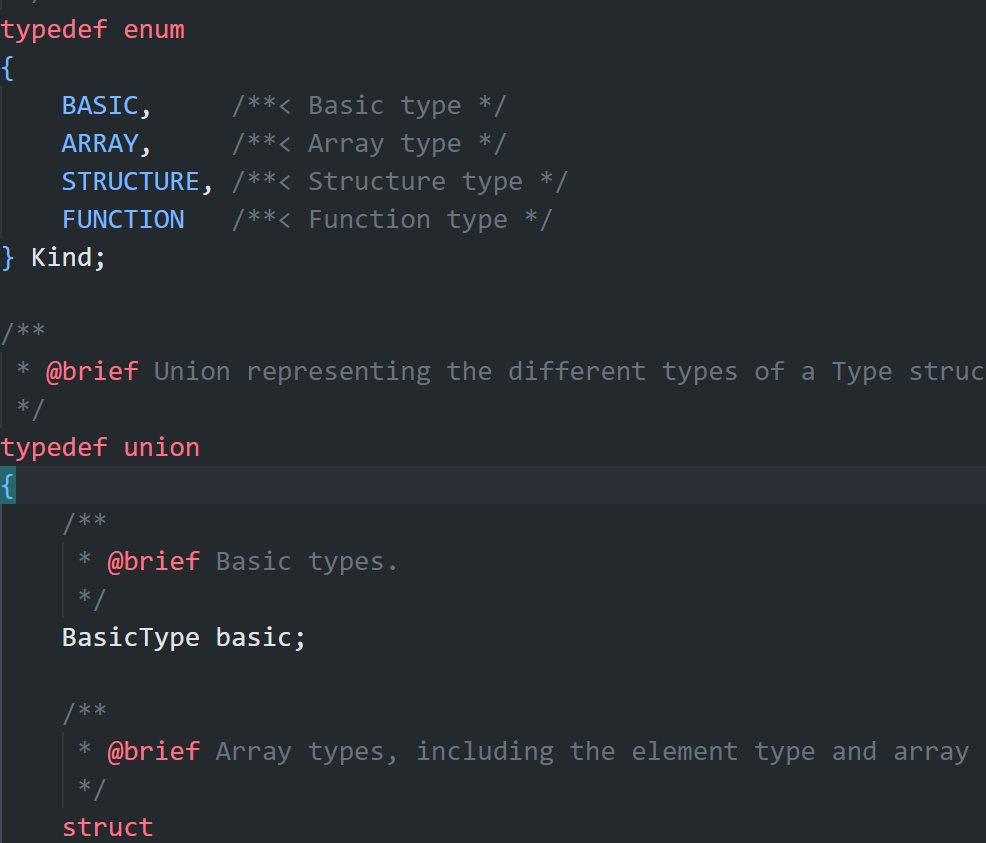
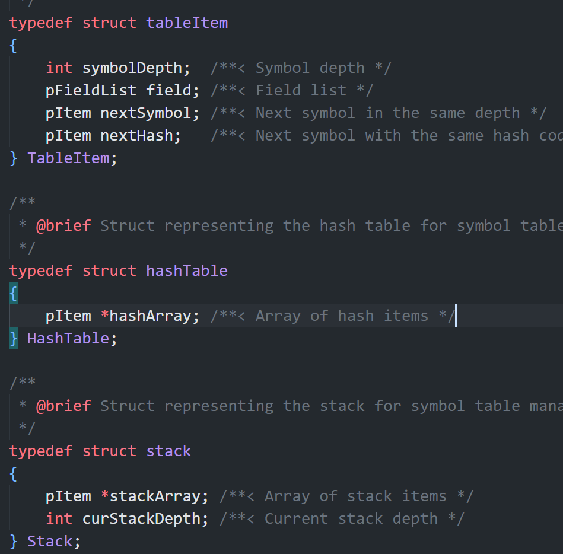

# 实验报告三

实现了c--语言的中间代码生成，选做结构体相关的中间代码生成，Operand和interCode的结构体定义按照实验教程中的中给出的建议。对于许多代码都具有doxygen风格的代码的详细注释，不再赘述。

对中间代码的生成没有做太多优化，主要对直接使用的符号和立即数进行了一步去掉一步创建新临时变量的优化。
因为翻译规则在讲义中已经明确给出，主要工作是数据结构的设计，相关接口的具体实现，同实验二中间代码的生成也是进入ExtDefList后的事，另外更具我们的诸多假设，可以在这里选择不在语义分析时候生成IR，而是语义分析后不删除符号表再次遍历语法树生成IR，所以再次遍历语法树寻找ExtDefList节点然后开始处理。

其次，大部分代码的中间代码的生成都已经在实验教程中给出，只有大约5个的翻译没有给出，这些代码的翻译也是大同小异，类似SDT其他的代码翻译即可。

另外，对于附加题的定义域的嵌套，使用了如上图的栈的结构进行分析，完全模拟了课上的作用域的定义和使用以及查询。
