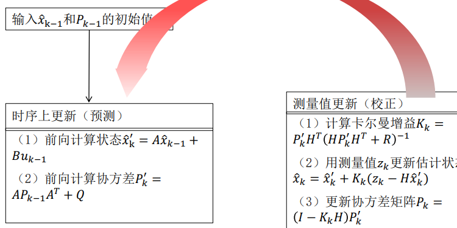
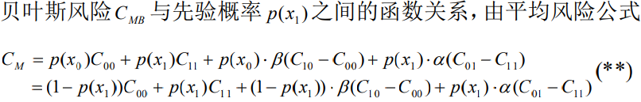
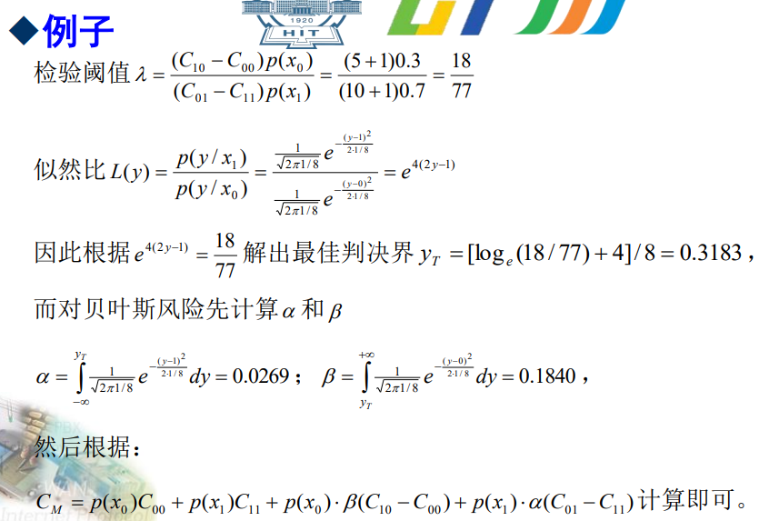
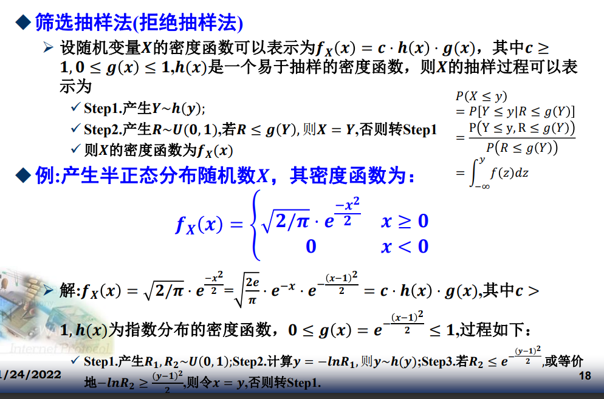

#### 高斯过程
n元正太分布概率密度函数
$$
f(\bold X) = \frac{1}{(2\pi)^{\frac{n}{2}}|\bold B|^{1/2}}\exp({-\frac{1}{2}*
(X-\mu)B^{-1}(X-\mu)})
$$

定理：若正态过程 𝜉(𝑡); 𝑡 ∈ 𝑇 在T上是均方可积的，则
$$
\eta(t)=\int_a^b\xi(u)du \\
\eta(t)=\int_a^b\xi(u)h(t,u)du
$$
也是正态过程。

离散白噪声：定义在离散域上的零均值随机函数𝑿(𝒌)，如果𝑿(𝒌)与𝑿(𝒋) 对于任意𝒌 ≠ 𝒋都不相关
#### 维纳过程

义：若一随机过程 𝑊(𝑡); 𝑡 ≥ 0 满足：
$$
（1）𝑊(𝑡)是独立增量过程。\\
（2）∀ 𝑠,𝑡 > 0, 𝑊(𝑠 + 𝑡) − 𝑊(𝑠)  ··N(0,c^2t)      \\
（3） 𝑊(𝑡)是关于t的连续函数
$$
则称 𝑊(𝑡); 𝑡 ≥ 0 是布朗运动或维纳过程。
**维纳过程数学特性**
$$
m_{W} = 0\\
R_{W}(s,t) = min(s,t)
$$
维纳过程不是平稳过程，$\frac{\partial w}{\partial x}$为高斯分布的白噪声，维纳过程也是正态过程

#### 卡尔曼滤波
$$
x_𝑘 = 𝐴𝑥_{𝑘−1} + 𝐵𝑢_{𝑘−1} + 𝑞_{𝑘−1}\\
z_k = Hx_k + r_k\\
q~~ N(0,Q)\\
r~~~N(0,R)
$$

#### 图模型

#### 马尔可夫随机场
成对马尔可夫性（pairwise Markov property）：给定所有其他变量，两个非邻接变量条件独立。这是因为两个节点没有直接路径，并且所有其他路径上都有确定的观测节点，因此这些路径也将被阻隔。

#### 随机游走
一维随机游走称为随机徘徊。
推论1.经过n步返回原点的概率
$$
p(\xi_n) = \begin{cases}
0 & n=2k+1 \\
C^{n/2}_{n}p^{n/2}q^{n/2} & n=2k 
\end{cases}
$$
经过2n步返回原点，记作 $u_{2n}=C^n_{2n}p^nq^n$
推论二：经过2n步首次返回原点记作$v_{2n}$：$u_{2n} = \sum_{k-1}^{n}v_{2k}u_{2n-2k}$,根据上述可以解得$v_{2k}$
推论三：i经过n步转移到j,
$$p_{ij}(n) = P(X_n=j|X_0=i)= \begin{cases}
    C_n^{\frac{n+j-i}{2}}p^{\frac{n+j-i}{2}}q^{\frac{n-j+i}{2}}& n>|j-i|\And n \models j-i (mod~~ 2)\\
    0 &else
\end{cases}$$
随即徘徊的均值和方差：
$$
\begin{align}
E X_n &= E X_0 + n(2p-1)\\
Var X_n &=4np(1-p)\\
Cov (X_n,X_m) &= 4p(1-p)*\min(n,m)
\end{align}
$$

**无向图上的随机游走**
$$
p_{uv} = \begin{cases}
    \frac{1}{d(u)}& (u,v)\in E\\
    0 & otherwise
\end{cases}
$$
推论1：无向图随机游走收敛于$\Pi$, $\Pi_v = \frac{d(v)}{2E}$
推论2：$h_{uv}表示u到v的期望步数，h_{uu}=\frac{2E}{d(u)}$
推论3：图G(V,E)的覆盖时间大于4|V|* |E|

#### 随机模拟
生成[0,1]的均匀随机数，一般常用乘加结合。
$y_{n+1}=(4a+1)y_n+(2b+1)(mod~~M)~~~~x_{n+1}=\frac{y_{n+1}}{M}$

**根据均匀分布产生任意分布随机数**
1. 逆变换法
对于单调函数，将值域变换到[0,1],然后直接求反函数即可

2. 拒绝采样法

#### 智能优化算法

