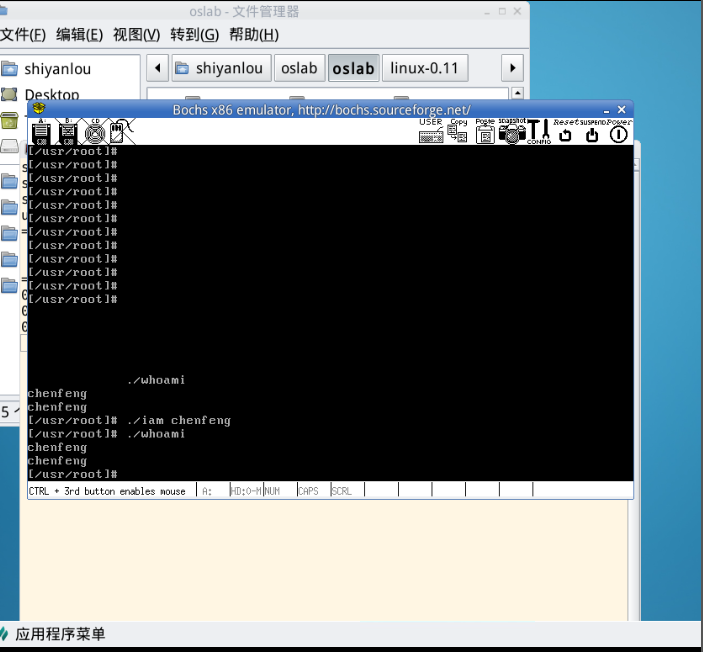
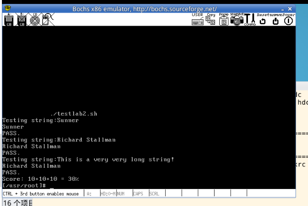
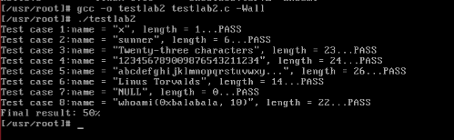

# 实验四实验报告

## 实验成功输出截图：

使用脚本testlab2.sh验证输出结果：

成功输出结果，完成实验

最初，对于testlab2的输出总是会多一个字符，猜测可能的原因是计算了最后的/0字符，最终修改who.c的length符号之后完成了本次实验。

## 问题
1. 从 Linux 0.11 现在的机制看，它的系统调用最多能传递几个参数？
   
   我们从实验的过程中可以发现，系统调用通过INT 80来进行，通过CPU的寄存器来传递参数，通过eax来传递系统调用号。根据Linux 0.11源代码中的system_call.s文件，我们可以看到系统调用的实现细节。在system_call函数中，它通过pushl指令将三个寄存器的值（%ebx，%ecx，%edx）压入堆栈，这些值作为参数传递给系统调用。因此，我们可以得出结论，Linux 0.11的系统调用最多可以传递三个参数​1。
2. 你能想出办法来扩大这个限制吗？

    1. 使用更多的寄存器：你可以尝试使用更多的寄存器来传递参数。可以使用%esi和%edi寄存器来传递额外的参数。但这种方法的问题在于，更多的寄存器在系统调用之前和之后都需要被保存和恢复，这可能会增加系统调用的开销。

    2. 使用堆栈来传递参数：这是一个常见的解决方案，尤其在需要传递大量参数的情况下。将所有的参数压入堆栈，然后在系统调用中通过堆栈来访问这些参数。这种方法的优点是可以传递任意数量的参数，但缺点是访问堆栈的速度通常比访问寄存器慢。

3. 用文字简要描述向 Linux 0.11 添加一个系统调用 foo() 的步骤。
   1. 在`include/unistd.h`文件中定义`#define __NR_foo xx`,定义系统调用号。
   2. 修改系统调用总数, 在文件：`kernel/system_call.s`中修改`nr_system_calls`系统调用总数。
   3. 添加系统调用名，并维护系统调用表，在`include/linux/sys.h`中定义该函数`extern int sys_foo();`，并在系统调用表中添加该函数。
   4. 在`linux-0.11/kernel`目录下添加`foo.c`文件，并编写相应的代码
   5. 修改`makefile`文件，添加`foo.c foo.o`等文件的依赖和生成。
   6. 运行`make all`命令