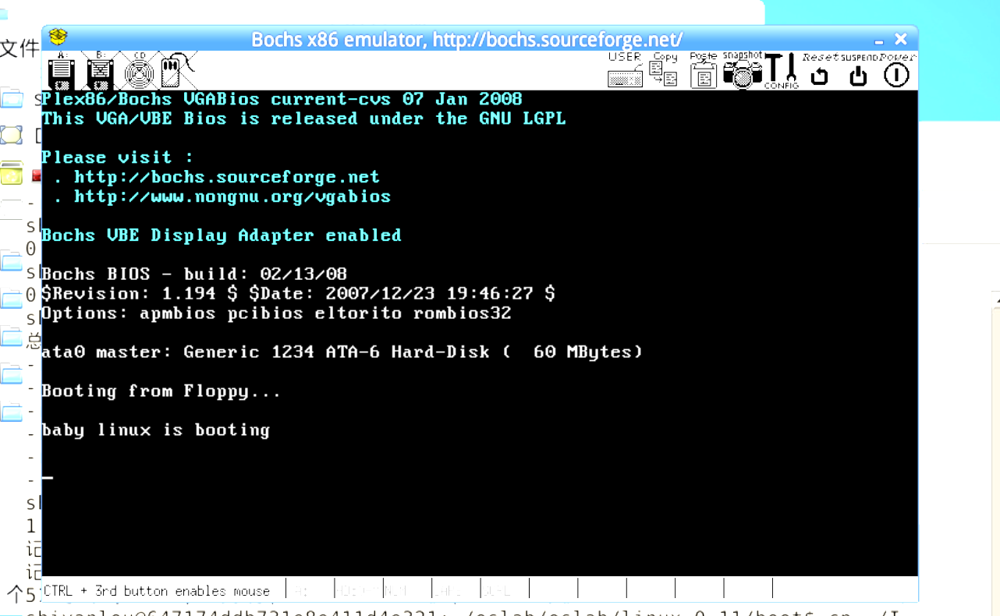
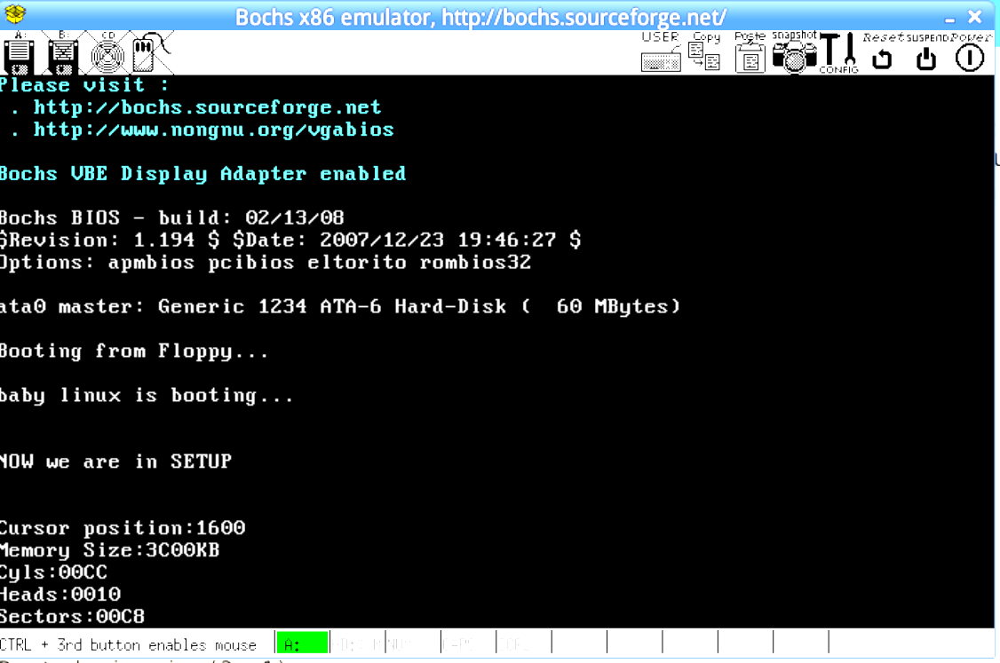

# 实验三实验报告

## 实验完成截图

## 实验问题

**有时，继承传统意味着别手蹩脚。 x86 计算机为了向下兼容，导致启动过程比较复杂。 请找出 x86 计算机启动过程中，被硬件强制，软件必须遵守的两个“多此一举”的步骤（多找几个也无妨），说说它们为什么多此一举，并设计更简洁的替代方案。**

- 问题1：在x86计算机的启动过程中，会首先将引导扇区读入 0x7c00 处，然后跳到 0x7c00 开始执行，接着，为了方便后面程序的加载与运行，又会将自己移动后靠后的位置（实验中linux0.11移动到0x9000处）

> 解决方案：尽量扩大实地址模式BIOS可访问内存的范围，比如在Linux0.11中可以直接引导到0x9000处

- 问题 2：在BIOS初始化的时候，会在内存的初始位置放置1kb的中断向量表，来方便BIOS中断使用。 如果在主模块中需要使用一些由BIOS中断得到的硬件参数的情况下，就不能在主模块的加载开始过程中直接覆盖掉这1kb的中断向量表而让主模块直接从内存的初始位置加载（从内存的初始位置加载的话以后代码中的地址就是实际的地址，能极大的方便操作）。为了解决这个问题，在linux 0.11 中，会将system先加载到不与中断向量表冲突的地方，然后再将主模块移动到内存的初始位置，再将这个中断向量表覆盖掉

> 解决方案：1kb的中断向量表不放在内存的初始位置，而是放到其他实模式下能够寻址的其他地方。 这样操作系统的system模块就会直接加载到内存的初始位置。

- 问题3： 实模式启动：x86 计算机在启动时首先进入 16 位实模式，这是为了向下兼容早期的 16 位软件。在这种模式下，CPU 的指令指针会指向 0xffff:0000，这就导致了一个问题，即现代的 x86 计算机在启动时会被限制在一个较小的寻址空间​1​。

> 解决方案: 取消实模式启动：现代操作系统几乎都是基于 32 位或 64 位的，因此可以考虑取消 16 位实模式的启动，直接从 32 位或 64 位模式启动