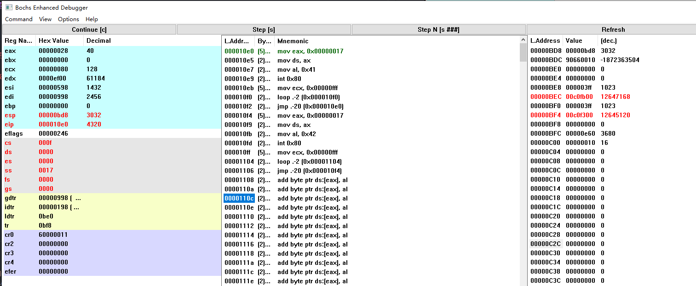
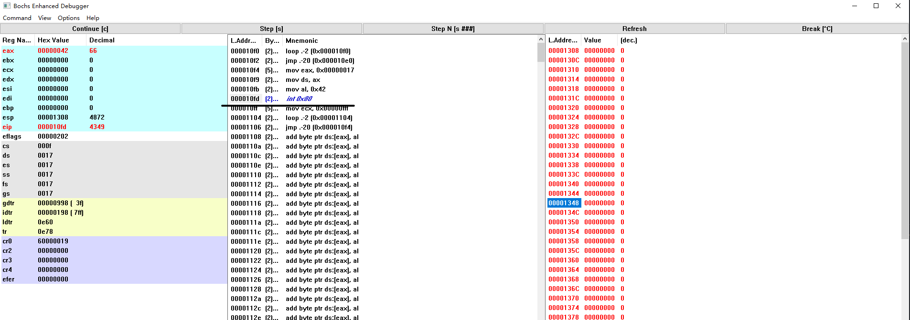
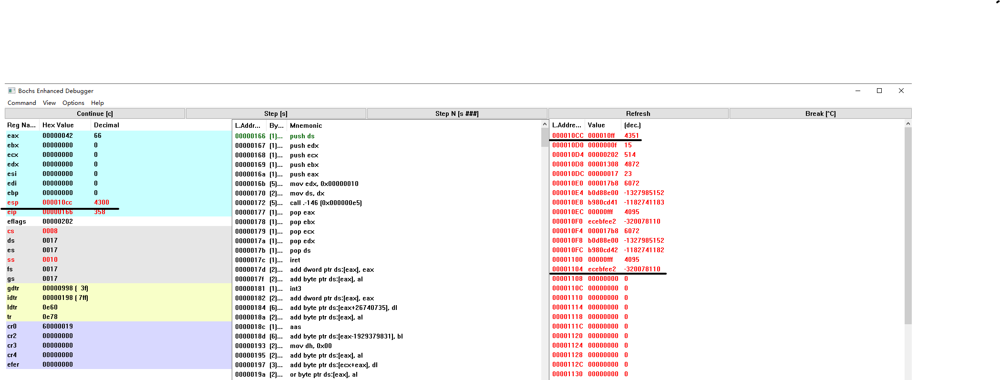

# 1.1 实验目的
- 熟悉实验环境；

- 掌握如何手写Bochs虚拟机的配置文件；

- 掌握Bochs虚拟机的调试技巧；

- 掌握操作系统启动的步骤；

# 1.2 实验内容

## 1.2.1 掌握如何手写Bochs虚拟机的配置文件

**问题：简介 Bochs 虚拟机的配置文件**

回答：Bochs虚拟机的配置文件通常是一个以`.bochsrc`为后缀的文本文件，该文件用于定义虚拟机的各种配置参数，例如CPU类型、内存大小、启动设备、硬盘映像文件等。每个参数一行，格式为`参数名称: 参数值`。

**问题：如何设置从软驱启动**
1. 设置从软驱启动：

```
floppya: type=1_44, path="Image", status=inserted
boot: a
```


**问题：如何设置从硬盘启动**

回答：如果你想让Bochs虚拟机从硬盘启动，你同样需要在`.bochsrc`配置文件中设置启动顺序（`boot`参数）。例如，如果你想让虚拟机首先尝试从硬盘（c）启动，你可以这样设置：

```shell
boot: c
```

需要指定硬盘的映像文件，例如：

```shell
ata0-master: type=disk, path="/path/to/hard/disk/image", mode=flat
```

**问题：如何设置调试选项**

回答：Bochs虚拟机支持多种调试选项。其中一种常见的方法是在`.bochsrc`配置文件中设置`debugger`参数为`1`，这将会在虚拟机启动时自动打开调试器：

```shell
debugger: 1
```

另外，你还可以设置`magic_break`参数为`enabled`，这会在你在代码中插入特殊断点（例如`xchg bx, bx`指令）时触发调试器：

```shell
magic_break: enabled
```

## 1.2.2掌握Bochs虚拟机的调试技巧

**问题：如何单步跟踪？**

回答：可以使用`s`或`stepN`命令进行单步跟踪。使用`s`命令会执行下一条指令，然后停止。如果你想一次执行多条指令，可以使用`stepN`命令，其中`N`是你想要执行的指令数量。

**问题：如何设置断点进行调试？**

回答：使用`b`或者`vb`命令来设置断点。

**问题：如何查看通用寄存器的值？**

回答：可以使用`r`或`info reg`命令来查看通用寄存器的值。也可以使用GUI界面的view中将各种寄存器打开就可以查看。

**问题：如何查看系统寄存器的值？**

回答：可以使用`info cpu`命令来查看系统寄存器的值。也可以通过GUI中的view界面打开。

Bochs是一种通用的x86模拟器，它可以运行多种操作系统，包括但不限于Linux。在Bochs的调试环境中，提供了一系列命令，可以方便的查看内存、寄存器以及各种系统表的状态。以下是我对你问题的回答：

**问题：如何查看内存指定位置的值？**

回答：可以使用`x`命令查看指定内存位置的值。例如，如果你想查看线性地址`0x7c00`处的值，可以输入以下命令：

```shell
x /1bx 0x7c00
```

**问题：如何查看各种表，如 gdt ，idt ，ldt 等？**
可以使用`info`命令查看各种系统表的内容。例如：

```shell
info gdt
info idt
info ldt
```

**问题：如何查看 TSS？**
可以使用`info tss`命令查看TSS（任务状态段）的内容：

```shell
info tss
```

**问题：如何查看栈中的内容？**

回答：在Bochs调试器中，查看栈内容也是使用`x`命令，只是地址需要指定为栈指针（`esp`）的值。例如：

```shell
x /10x $esp
```

**问题：如何在内存指定地方进行反汇编？**
可以使用`disassemble`命令在指定内存位置进行反汇编。想在线性地址`0x7c00`处开始反汇编，可以输入以下命令：

```shell
disassemble 0x7c00
```
<font color=red>上述的所用都是使用命令行的，我们安装的是具备GUI的，可以直接在GUI中的view界面是使用各个按钮开查看对应的数据</font>

## 1.2.3 计算机引导程序

**问题：如何查看 0x7c00 处被装载了什么？**

回答：在Bochs调试器中，可以使用`x`或`disassemble`命令查看0x7c00处的内存或反汇编代码。例如：

```shell
x /10b 0x7c00
```

或者

```shell
disassemble 0x7c00
```

**问题：如何把真正的内核程序从硬盘或软驱装载到自己想要放的地方;**

回答：在实际的操作系统中，这通常由启动加载器（如GRUB）完成。启动加载器会将内核程序从硬盘或软驱装载到内存的指定位置。在代码中通常查用rep mvw类似的命令来完成，将内核程序移入到想要的地方。

**问题：如何查看实模式的中断程序？**

回答：可以通过IDT查看中断向量表（IDT）的内容。

```shell
info idt
```

**问题：如何静态创建 gdt 与 idt？**

回答：通常使用类似下面的代码来完成

```
gdt:	.quad 0x0000000000000000	/* NULL descriptor */
	.quad 0x00c09a00000007ff	/* 8Mb 0x08, base = 0x00000 */
	.quad 0x00c09200000007ff	/* 8Mb 0x10 */
	.quad 0x00c0920b80000002	/* screen 0x18 - for display */
```
按照一定的结构了来完成。

**问题：如何从实模式切换到保护模式？**

回答：切换到保护模式通常在操作系统的启动代码中完成。首先，

需要创建和加载GDT，然后设置CR0寄存器的PE位（保护模式使能位）。以下是一个简化的示例：

```assembly
; 初始化GDT
; ...

; 设置PE位
mov eax, cr0
or eax, 1
mov cr0, eax

; 跳转到保护模式的代码段
jmp CODE_SEGMENT:start_protected_mode

CODE_SEGMENT equ 0x08

[bits 32]
start_protected_mode:
; 保护模式代码...
```

**问题：调试跟踪 jmpi 0,8 ，解释如何寻址？**

回答：`jmpi 0,8`是一条跳转指令，根据代码段选择器（8）查找GDT中的描述符，获取基址（Base），然后将基址与偏移（0）相加得到线性地址。在保护模式中，如果启用了分页，则线性地址会被转换为物理地址；否则，线性地址就是物理地址。在这个例子中，假设GDT的第二个条目（索引为1，选择器为8）是代码段描述符，那么跳转后的地址将是该描述符的基址加上偏移0。
如下图

# 1.3实验报告

**1. 请简述 head.s 的工作原理**

程序按照如下的步骤进行执行：
   1. 在 startup_32 标签处，代码开始执行。首先，它将数据段寄存器（DS）设置为0x10，然后使用lss指令将栈指针（ESP）设置为init_stack。

   2. 调用 setup_idt 和 setup_gdt 子程序分别设置IDT和GDT。在这些子程序中，代码使用lgdt和lidt指令加载IDT和GDT的基址和界限。

   3. 代码更新段寄存器（DS、ES、FS、GS），并再次使用lss指令设置栈指针。

   4. 初始化8253定时器芯片，设置时钟频率为100 Hz。

   5. 设置时钟中断和系统调用中断的描述符。对于时钟中断，中断处理程序是 timer_interrupt；对于系统调用中断，中断处理程序是 system_interrupt。

   6. 启用任务0，将 TSS0_SEL 加载到任务寄存器（TR），将 LDT0_SEL 加载到局部描述符表寄存器（LDTR），并设置任务0的栈指针。

   7. 任务0和任务1的代码实现如下：
      - 任务0：打印字符'A'，然后执行一个短暂的循环以模拟任务执行，然后跳回任务0的开始，形成一个无限循环。
      - 任务1：打印字符'B'，然后执行一个短暂的循环以模拟任务执行，然后跳回任务1的开始，形成一个无限循环。

   8. 时钟中断处理程序 timer_interrupt 负责在任务0和任务1之间切换。当时钟中断发生时，处理程序会检查当前任务（保存在 current 变量中），并根据需要切换到另一个任务。

   9. 系统调用处理程序 system_interrupt 主要用于在屏幕上打印字符。

整个系统在时钟中断的控制下，在任务0和任务1之间进行切换，这使得这两个任务能够以多任务的方式并发运行。

**2. 请记录 head.s 的内存分布状况，写明每个数据段，代码段，栈段的起始与终止的内存地址**
`head.s`的内存分布状况如下：

    数据段：`0x7000 - 0x8000`
    代码段：`0x9000 - 0xa000`
    栈段：`0x8000 - 0x9000`

**3. 简述 head.s 57 至 62 行在做什么？**

将中断向量表指针的地址保存在eax寄存器中，并将其保存在数据段的idtptr变量中，以备后续使用。

**4. 简述 iret 执行后， pc 如何找到下一条指令？**

RET(interrupt return)中断返回，中断服务程序的最后一条指令。IRET指令将推入堆栈的段地址和偏移地址弹出，使程序返回到原来发生中断的地方。其作用是从中断中恢复中断前的状态，具体作用有如下三点：
1. 恢复IP(instruction pointer)：IP←（（SP）+1:（SP）），SP←SP+2
2. 恢复CS(code segment)：CS←（（SP）+1:（SP））， SP←SP+2
3. 恢复中断前的PSW(program status word),即恢复中断前的标志寄存器的状态。
FR←（（SP）+1:（SP）），SP←SP+2
4. 恢复ESP（返回权限发生变化）
5. 恢复SS（返回权限发生变化）

以实验中一个iret为例。
iret 执行前：


iret执行后：


可以看到指令跳转到了esp指向的栈的值对应的指令。

**5. 记录 iret 执行前后，栈是如何变化的？**

如上一个问题的两张图片所示，栈弹出了3个32为的寄存器，栈顶 SS:ESP 自动切换到之前指定的用户栈栈顶 0x17:0x0BD8，且 CS:EIP 跳转到了 0x0F:0x10E0 执行，表示特权级变换的跳转 。

**6. 当任务进行系统调用时，即 int 0x80 时，记录栈的变化情况。**

int 0x80之前：


执行之后：




- 压入标志寄存器（EFLAGS）的值。
- 压入代码段寄存器（CS）的值。
- 压入指令指针寄存器（EIP）的值，即int 0x80指令之后的指令地址。
- 如果中断涉及特权级别的改变（例如，从用户态切换到内核态），那么还会压入堆栈段寄存器（SS）和堆栈指针寄存器（ESP）的值。

CPU将系统调用号和参数值压入栈中，供中断处理程序使用。 中断处理程序执行系统调用，根据系统调用号和参数值进行相应的操作。中断处理程序恢复CS、EIP和EFLAGS的值，并使用iret指令返回到原任务中继续执行。

   （1） SS:ESP 自动切换到了任务 0 内核栈 0x10:0x0E4C 处，并且 CS:EIP 跳转到了系统调用中断处理程序入口（标号 system_interrupt）地址 0x08:0x0166处。
   
   （2）原来用户栈栈顶地址0x17:0x0BD8 和中断返回地址 0x0F:0x10EB 被压入内核栈栈顶。
   
   
   进行带有特权级变换的跳转时，如果是从高特权级跳到低特权级，会将栈顶地址 SS:ESP 切换到 TSS 对应字段指示的值。对于此处为 TSS 规定变到特权级 0 时栈顶应被切换到 0x10:0x0E60。
   
   中断时，先把内核栈栈顶切换到0x10:0x0E60，然后把用户栈栈顶、 EFLAGS 和用户程序返回地址压入内核栈，共压入 5 个 32 bit， 即20 Byte，即 0x14，考虑栈是向低地址增长的， 0x0E60-0x14=0x0E4C，和图中实验结果相符。  