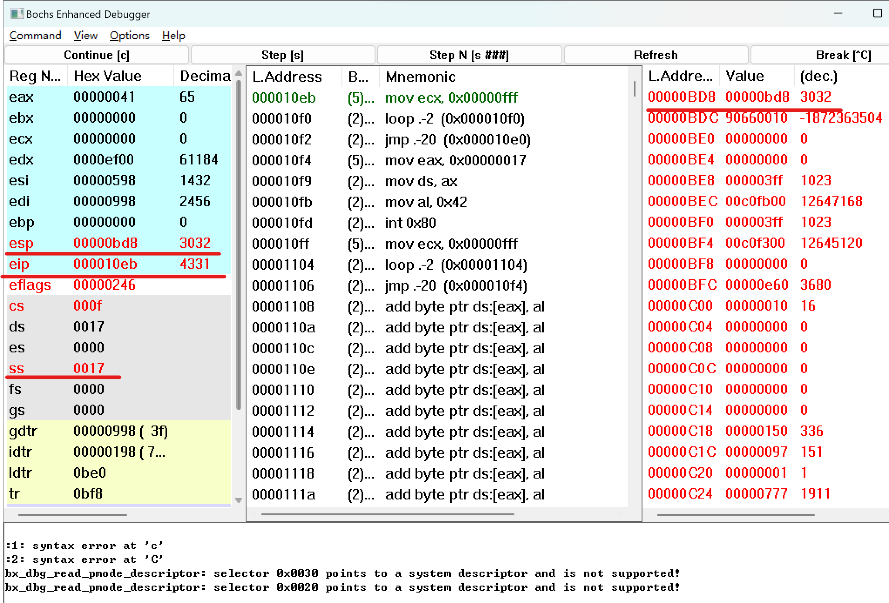
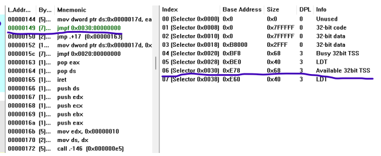
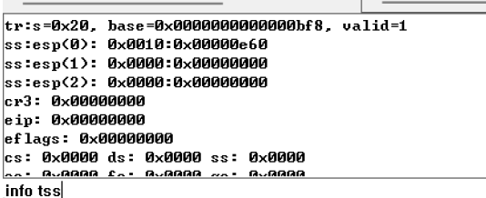
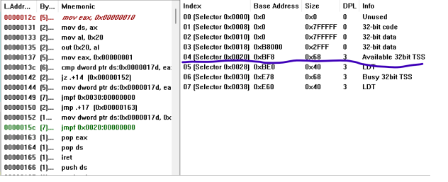
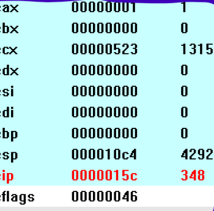
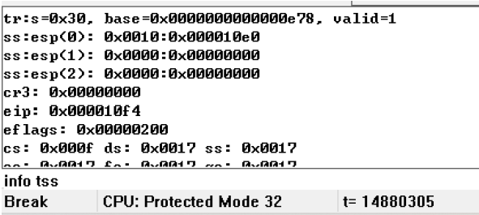

# 2.1. 实验目的

- 通过调试一个简单的多任务内核实例，使大家可以熟练的掌握调试系统内核的方法；
- 掌握Bochs虚拟机的调试技巧；
- 通过调试和记录，理解操作系统及应用程序在内存中是如何进行分配与管理的；

# 2.2. 实验内容

通过调试一个简单的多任务内核实例，使大家可以熟练的掌握调试系统内核的方法。 这个内核示例中包含两个特权级 3 的用户任务和一个系统调用中断过程。我们首先说明这个简单内核的基本结构和加载运行的基本原理，然后描述它是如何被加载进机器 RAM 内存中以及两个任务是如何进行切换运行的


# 2.2.1

**问题：如何单步跟踪？**

回答：可以使用`s`或`stepN`命令进行单步跟踪。使用`s`命令会执行下一条指令，然后停止。如果你想一次执行多条指令，可以使用`stepN`命令，其中`N`是你想要执行的指令数量。

**问题：如何设置断点进行调试？**

回答：使用`b`或者`vb`命令来设置断点。

**问题：如何查看通用寄存器的值？**

回答：可以使用`r`或`info reg`命令来查看通用寄存器的值。也可以使用GUI界面的view中将各种寄存器打开就可以查看。

**问题：如何查看系统寄存器的值？**

回答：可以使用`info cpu`命令来查看系统寄存器的值。也可以通过GUI中的view界面打开。

Bochs是一种通用的x86模拟器，它可以运行多种操作系统，包括但不限于Linux。在Bochs的调试环境中，提供了一系列命令，可以方便的查看内存、寄存器以及各种系统表的状态。以下是我对你问题的回答：

**问题：如何查看内存指定位置的值？**

回答：可以使用`x`命令查看指定内存位置的值。例如，如果你想查看线性地址`0x7c00`处的值，可以输入以下命令：

```shell
x /1bx 0x7c00
```

**问题：如何查看各种表，如 gdt ，idt ，ldt 等？**
可以使用`info`命令查看各种系统表的内容。例如：

```shell
info gdt
info idt
info ldt
```

**问题：如何查看 TSS？**
可以使用`info tss`命令查看TSS（任务状态段）的内容：

```shell
info tss
```

**问题：如何查看栈中的内容？**

回答：在Bochs调试器中，查看栈内容也是使用`x`命令，只是地址需要指定为栈指针（`esp`）的值。例如：

```shell
x /10x $esp
```

**问题：如何在内存指定地方进行反汇编？**
可以使用`disassemble`命令在指定内存位置进行反汇编。想在线性地址`0x7c00`处开始反汇编，可以输入以下命令：

```shell
disassemble 0x7c00
```
<font color=red>上述的所用都是使用命令行的，我们安装的是具备GUI的，可以直接在GUI中的view界面是使用各个按钮开查看对应的数据</font>

# 2.3 实验报告

**当执行完 `system_interrupt` 函数，执行 153 行 `iret` 时，记录栈的变化情况。**

答：执行iret前：


现在栈顶 SS:ESP 指向 0x10:0x0E4C，并且可以看见内核栈栈顶的中断返回地址 0x0F:0x10EB 和用户栈栈顶
地址 0x17:0x0BD8。然后点 Step[s] 执行 iret，观察栈状态的变化：
执行iret之后：



栈顶 SS:ESP 被切换到了 0x17:0x0BD8，并且中断返回到了 0x0F:0x10EB 处。


**当进入和退出 `system_interrupt` 时，都发生了模式切换，请总结模式切换时，特权级是如何改变的？栈切换吗？如何进行切换的？**

在Linux中，特权级别通过特权级（Privilege Level）或受限模式（Ring Level）来表示。特权级别决定了对系统资源的访问权限和可执行的指令集。

1. 用户模式（Ring 3）切换到内核模式（Ring 0）：
   - 当发生中断、异常或系统调用时，处理器会检测到这些事件并触发模式切换。
   - 处理器会将当前的指令指针和处理器状态保存到内核栈中，以便在中断处理完成后能够恢复现场。
   - 处理器将特权级别提升为最高特权级别（Ring 0），以便执行内核代码。
   - 内核代码执行完成后，处理器会从内核栈中恢复之前保存的指令指针和处理器状态，将特权级别降低回用户模式。

2. 内核模式（Ring 0）切换回用户模式（Ring 3）：
   - 当内核需要返回到用户空间时，处理器会将当前的指令指针和处理器状态保存到内核栈中，以便在切换回用户模式后能够恢复现场。
   - 处理器将特权级别降低回用户模式特权级别（Ring 3）。
   - 处理器从内核栈中恢复之前保存的指令指针和处理器状态，将控制权返回给用户空间的应用程序。

在模式切换的过程中，涉及到栈的切换。当从用户模式切换到内核模式时，处理器会使用内核栈保存当前的指令指针和处理器状态。这是为了确保在中断处理完成后能够恢复到中断发生之前的执行状态。类似地，当从内核模式切换回用户模式时，处理器会使用内核栈保存先前的指令指针和处理器状态，以便在切换完成后能够继续执行用户空间的应用程序。

模式切换是由处理器硬件和操作系统内核共同管理的。处理器根据中断、异常或系统调用的发生来触发模式切换，并通过保存和恢复现场的操作实现特权级别和栈的切换。


**当时钟中断发生，进入到 `timer_interrupt` 程序，请详细记录从任务 0 切换到任务 1 的过程。**

进入到`timer_interruput`程序之后，跟踪程序运行，可以发现程序执行了一个`jmpf 0x30:0`的指令，我们打开GDT进行查看



该指令将一个 TSS 选择子装入 CS，实际上就是为了将任务切换到这个 TSS。查看`TSS`



TSS 发生了改变，并且现在各个寄存器的值和 TSS 里的各个字段是一致的，这说明任务切换时会
根据 TSS 的各个字段修改寄存器。

**又过了 10ms ，从任务1切换回到任务 0 ，整个流程是怎样的？ TSS 是如何变化的？各个寄存器的值是如何变化的？**

`timer_interruput`根据变量`current`的值切换到另一个任务，任务1输出B之后，通过一个计时器，该值存在`ecx`寄存器中，在`ecx`寄存器中归零之后，再次进入`timer_interruput`切换到另一个任务。



任务的切换也是通过一个`jmpf`指令，通过查询`GDT`可以发现`0x20`是另一个选择子。
现在查询TSS和寄存器值





<font color=b>跳转后</font>


可以看到tss中不再是跳转前为0的状态，tss保存了任务的上下文信息（寄存器和特权级别等信息）。

**请详细总结任务切换的过程。**

任务的切换涉及到了下面的数据的变化

1. 寄存器：
   - 当前任务被切换时，操作系统将保存当前任务的寄存器状态（如通用寄存器、程序计数器、堆栈指针等）到当前任务的TSS中。
   - 操作系统从下一个要执行的任务的TSS中加载寄存器状态，包括通用寄存器、程序计数器和堆栈指针等。

2. TSS（任务状态段）：
   - 当前任务被切换时，操作系统会将当前任务的寄存器状态保存到当前任务的TSS中的相应字段。
   - 操作系统从下一个要执行的任务的TSS中加载寄存器状态到寄存器中。
   - TSS还包含了其他与任务切换相关的信息，例如特权级别、任务状态等。这些信息也会相应地更新和切换。

3. GDT（全局描述符表）：
   - GDT中存储了各个段（如代码段、数据段）的描述符，描述了段的基址、限制和访问权限等信息。
   - 在任务切换时，操作系统会根据新任务的需求修改相应段描述符的选择子，以确保下一个任务可以正确访问代码和数据。

4. IDT（中断描述符表）：
   - IDT中存储了中断和异常处理程序的入口地址。
   - 操作系统可能会在任务切换时更新IDT中的中断和异常处理程序的入口地址，以确保切换后能正确处理中断和异常。

任务在输出之后会在计时器下等待10ms，然后中断程序会当前执行的任务选择另一个任务，从而实现任务切换，在任务切换时，上述的数据会产生变化，从而存储任务的上下文信息，在之后继续执行的时候，程序能够恢复原本的执行状态。
 
