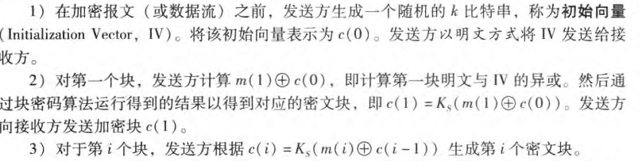
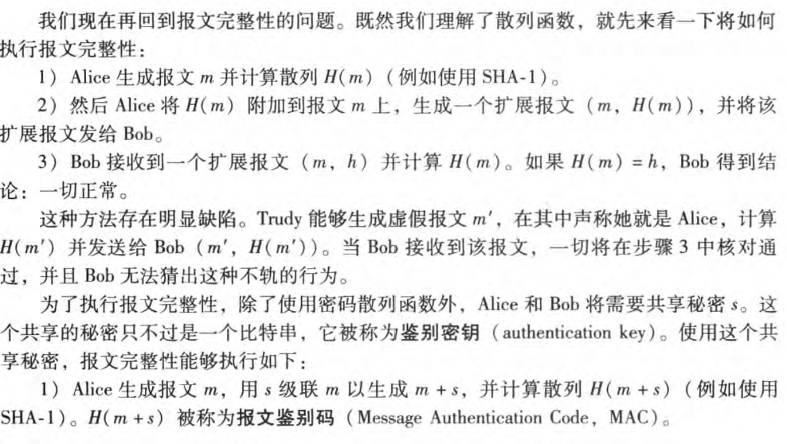
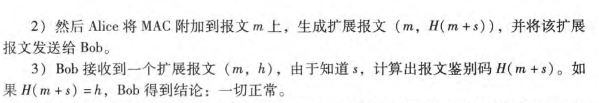
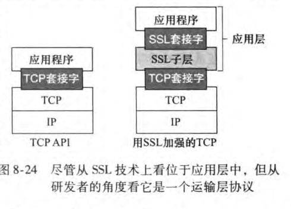
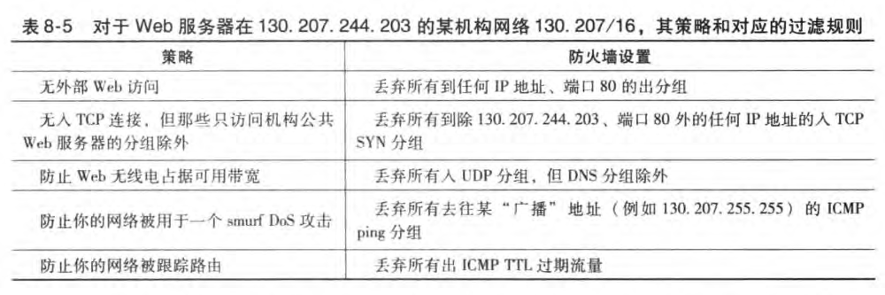
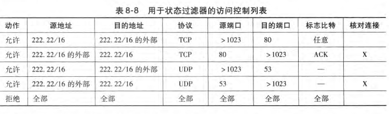

# 对称密钥密码体制

加密双方约定一个hash密码函数，通过将明文进行加密，然后在接收方进行解密。

## 块密码

1. 对于固定长度的块进行一一映射，生成密文。
2. 同时还需要生成一个排列表，来打乱生成的密文。
3. 为了添加随机性，还引入了一个随机生成的变量，将明文与之异或之后在加密，通常，一开始传输就传输这个随机生成的变量，并且不断的使用加密算法来生成该变量的后继来进行异或。

# 公共密钥密码体制

BOb要求具有对应的公钥和密钥$(K_{public},k_{private})$,Alice向Bob发送明文时，使用$K_{public}(data)$进行加密，Bob在收到密文时，使用$K_{private}(K_{public}(data)) =K_{public}(K_{private}(data))=data$的方式进行解密。

## RSA

RSA的加密基础是：不存在一个算法能够快速的对一个大整数进行因式分解。

**首先，需要明确：我们可以将所要传输的数据看作为一个个整数**

### 公钥和私钥的生成

1. 选取两个很大的素数p,q.p,q越大，越难破解。通常要求p,q乘积为一个1024比特数量级的大整数。
2. 计算$n=pq,z=(p-1)(q-1)$
3. 选择一个数e,使得$(e,z)=1$,这个e将会被用于公钥加密。
4. 求取一个数d，使得$ed \equiv 1(mod\ z)$,d将会被用于私钥的解密。
5. 发布的公钥为$K_{public} = (n,e)$,发布的私钥为$K_{private} = (n,d)$

### 公钥加密过程和私钥解密

Alice要发送一个m比特的整数给Bob，m < n,此时生成的密文 c 就为：

$$
c = m^e \ mod \ n
$$

Bob收到密文c之后进行解密：

$$
m = c^e \ mod \ n
$$

如果要自行推导，需要借助以下定理

$$
\text{if p,q are two primes,and} \\n = pq,z=(p-q)(q-1),\\
then \\
x^y \equiv x^{y\ mod\ z} (mod\ n)
$$

在实际过程中,RSA计算往往过于缓慢，因此通常使用RSA来加密对称密钥密码中的密钥。然后使用对称密钥进行数据的传输。

# 报文完整性和数字签名

目前，通过使用MD5和SHA-1两种hash函数生成一个128比特（MD5）或者160比特（SHA-1)来进行表示。

## 数字签名

前面接受的RSA，每个用户都保留一个私钥，通过使用这个私钥来对报文进行加密$K_{private}(data)$，可以生成一个独特的序列，任何接受方可以使用公钥来进行验证.
前面说过，数据很长，RSA处理很慢，所以可以通过约定一个通用的hash函数来先对数据进行hash处理，然后才进行私钥加密，从而生成一个短得多的序列，称为数字签名。

# SSL(Secure Socket Layer)

SSL 包含握手、密钥导出、数据传输三个过程

## 握手

> 1. 客户发送它支持的密码算法的列表，连同一个客户的不重数。
> 2. 从该列表中，服务器选择一种对称算法（例如AES)、一种公钥算法（例如具有特定密钥长度的RSA)和一种MAC算法。它把它的选择以及证书和一个服务器不重数返回给客户。
> 3. 客户验证该证书，提取服务器的公钥，生成一个前主密钥(Pre-Master Secret, PMS), 用服务器的公钥加密该PMS,并将加密的PMS发送给服务器r
> 4. 使用相同的密钥导出函数（就像SSL标准定义的那样），客户和服务器独立地从PMS和不重数中计算出主密钥(MasterSecret, MS)。然后该MS被切片以生成两个密码和两个MAC密钥。此外，当选择的对称密码应用于CBC(例如3DES或AES),则两个初始化向量(InitializationVector, IV)也从该MS获得，这两个IV分别用于该连接的两端。自此以后，客户和服务器之间发送的所有报文均被加密和鉴别（使用MAC),..
> 5. 客户发送所有握手报文的一个MAC。
> 6. 服务器发送所有握手报文的一个MAC.

## 数据传送

使用产生的4个密钥，并且添加序号、FIN鉴别等机制确保传输过程中不受攻击。

# 防火墙

防火墙分为三类：传统分组过滤器、状态过滤器、应用程序网关

## 传统的分组过滤器

根据每个分组的头部信息来确定分组丢弃的策略。
分组过滤器独立地检查每个数据报，然后基于管理员特定的规则决定该数据报应当允许通过还是应当丢弃。过滤决定通常基千下列因素：

- IP源或目的地址
- 在lP数据报中的协议类型字段：TCP、UDP、ICMP、OSPF等。
- TCP或UDP的源和目的端口勹• TCP标志比特：SYN、ACK等
- ICMP报文类型。
- 数据报离开和进入网络的不同规则）
- 对不同路由器接口的不同规则。
  例如：
  

# 状态分组过滤器

在传统的分组过滤器中，根据每个分组分离地做出过滤决定。状态过滤器实际地跟踪TCP连接，并使用这种知识作出过滤决定。

> 假设一个攻击者通过发送一个具有TCP源端口80和ACK标志置位的数据报，试图向机构网络中发送一个异常分组。进一步假设该分组具有源端口号12543和源IP地址150.23.23.155。当这个分组到防火墙时，防火墙核对表8-8中的访问控制列表，该表指出在允许该分组进入机构网络之前还必须核对连接表。该防火墙正确地核对了连接表，发现这个分组不是某进行中的TCP连接的一部分，从而拒绝了该分组。举第二个例子，假设一个内部的用户要在外部Web站点冲浪。因为该用户首先发送了一个TCPSYN报文段，所以该用户的TCP连接在连接表中有了记录。当Web服务器发送回分组(ACK比特进行了必要的设置），该防火墙核对了连接表并明白一条对应的连接在进行中。防火墙因此将让这些分组通过，从而不会干扰内部用户的Web冲浪活动。

## 应用程序网关

一个应用程序网关(applicationgateway)是一个应用程序特定的服务器，所有应用程序数据（入和出的）都必须通过它。多个应用程序网关可以在同一主机上运行，但是每一个网关都是有自己的进程的单独服务器。
