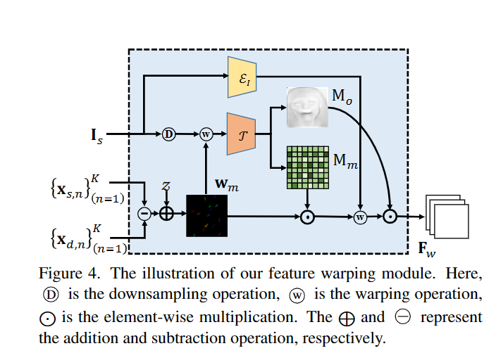

# CVPR2022

## Depth-Aware Generative Adversarial Network for Talking Head Video Generation

任务：给定一个视频（人物1）和一张图（人物2），生成人物2的相应的说话视频。

1. 根据视频相邻两帧动画，使用无监督学习生成深度图（Dense depth map）。

2. 将深度图和给定图像的2D representation相结合（concatenate），然后传入关键点检测器（keypoint estimator），得到$x_{d,n}，n-第n个关键点，d表示时刻$，该检测器直接采用了其他论文 First order motion model for image animation. NeurIPS, 2019.中设计
3. 运动场建模。将上一步得到的不同时刻的x作为输入，通过一个feature warping module得到特征图$F-w$。

4. 将得到的特征图和第一步得到的深度图通过一个跨模型注意力模块（Cross-modal Attention Mudule）得到特征图$F_g$

5. 经过一个解码器得到最终结果。

损失函数：
$$
\begin{aligned}
\mathcal{L}= & \lambda_P \mathcal{L}_P\left(\mathbf{I}_g, \mathbf{I}_d\right)+\lambda_G \mathcal{L}_G\left(\mathbf{I}_g, \mathbf{I}_d\right) \\
& +\lambda_E \mathcal{L}_E\left(\left\{\mathbf{x}_{d, n}\right\}_{n=1}^K\right) \\
& +\lambda_D\left(\mathcal{L}_D\left(\left\{\mathbf{x}_{s, n}\right\}_{n=1}^K\right)+\mathcal{L}_D\left(\left\{\mathbf{x}_{d, n}\right\}_{n=1}^K\right)\right)
\end{aligned}
$$

1. 感知损失。选择生产过程中的不同的feature map作为输入。
2. GAN损失。统计不同尺度上损失。
3. 关键点损失。对于有效关键点的损失
4. 关键点之间损失。避免生成关键点过于稠密。

实验结果：在脸部表情和运动方面都优于现有模型。
应用结果：。

## Show Me What and Tell Me How: Video Synthesis via Multimodal Conditioning

任务：能够结合图像和文字来生成对应的视频。主要是图像提供视频内容，文本提供运动信息。

