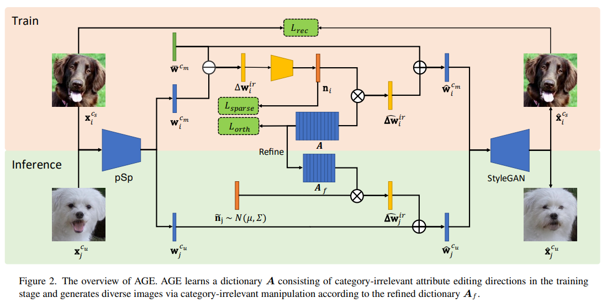

[TOC]

# CVPR2022

## Depth-Aware Generative Adversarial Network for Talking Head Video Generation

任务：给定一个视频（人物1）和一张图（人物2），生成人物2的相应的说话视频。

1. 根据视频相邻两帧动画，使用无监督学习生成深度图（Dense depth map）。

2. 将深度图和给定图像的2D representation相结合（concatenate），然后传入关键点检测器（keypoint estimator），得到$x_{d,n}，n-第n个关键点，d表示时刻$，该检测器直接采用了其他论文 First order motion model for image animation. NeurIPS, 2019.中设计
3. 运动场建模。将上一步得到的不同时刻的x作为输入，通过一个feature warping module得到特征图$F-w$。

4. 将得到的特征图和第一步得到的深度图通过一个跨模型注意力模块（Cross-modal Attention Mudule）得到特征图$F_g$

5. 经过一个解码器得到最终结果。

损失函数：
$$
\begin{aligned}
\mathcal{L}= & \lambda_P \mathcal{L}_P\left(\mathbf{I}_g, \mathbf{I}_d\right)+\lambda_G \mathcal{L}_G\left(\mathbf{I}_g, \mathbf{I}_d\right) \\
& +\lambda_E \mathcal{L}_E\left(\left\{\mathbf{x}_{d, n}\right\}_{n=1}^K\right) \\
& +\lambda_D\left(\mathcal{L}_D\left(\left\{\mathbf{x}_{s, n}\right\}_{n=1}^K\right)+\mathcal{L}_D\left(\left\{\mathbf{x}_{d, n}\right\}_{n=1}^K\right)\right)
\end{aligned}
$$

1. 感知损失。选择生产过程中的不同的feature map作为输入。
2. GAN损失。统计不同尺度上损失。
3. 关键点损失。对于有效关键点的损失
4. 关键点之间损失。避免生成关键点过于稠密。

实验结果：在脸部表情和运动方面都优于现有模型。
应用结果：。

## Show Me What and Tell Me How: Video Synthesis via Multimodal Conditioning

任务：能够结合图像和文字来生成对应的视频。主要是图像提供视频内容，文本提供运动信息。

## Modulated Contrast for Versatile Image Synthesis

本文提供了一种衡量生成的图片和GT图片相似性的新方法，该方法和cycleloss等方法不相上下，并在细节上面表现更好。
想法：之前的metric方法只能拉近正样本和anchor的距离，而不能拉开负样本和anchor的距离，因此生成的图像也会具有负样本的特点，而对比学习只会将负样本安装固定的比例推开，而不考虑负样本和anchor之间的相似性。本文的方法可以解决这个问题。（本文讲的是对比学习，但是对这个方向不了解）

$$
\begin{aligned}
& \min _{w i j, i, j \in[1, N]}\left[\sum_{i=1}^N \sum_{j=1}^N w_{i j} \cdot e^{x_i \cdot y_j / \beta}\right] \\
& \text { s.t. } \sum_{i=1}^N w_{i j}=1, \sum_{j=1}^N w_{i j}=1
\end{aligned}
$$
等价于下式：
$$
\min _T\langle C, T\rangle, \quad \text { s.t. }(T \overrightarrow{1})=1,\left(T^{\top} \overrightarrow{1}\right)=1,
$$

## Styleformer: Transformer based Generative Adversarial Networks with Style
Vector

概述：GAN基于CNN生成图片，不能考虑全局依赖，具有一定局限性，本文提出了一个基于transformer的模型能够生成模型，效果top 1.

### Method

1. 增加多头注意力的head数量。在深度可分离卷积中,每个输入通道与自己的卷积核相关联,生成一个输出通道。所以如果输入有n个通道,输出也会有n个通道,每个通道都有自己独立的卷积核。
而在自注意力操作中,所有的输入通道共享相同的一个巨大的核(注意力映射矩阵),所以所有的输出通道实际上都受到同一个核的影响。为了解决这个问题,作者提出增加自注意力模块中的多头注意力的头数。每个头都会有自己独立的注意力映射矩阵,所以每个输出通道可以由不同的头部的不同的映射矩阵影响。32是最佳的
2. 将LN放在前面。作者实验注意到，如果在self-attention之后归一化会干扰之后的风格注入，也不满足LN的条件，因此放在了前面。
3. 修改了残差连接。如图所示。
4. 删除了最后的全连接层。

****
上述是模型，下面是风格注入
5. style-input和style-value的注入。这两个向量是通过和stylegan一样的方法得到（老实说，我也不知道stylegan是怎么得到这个的），pixel-wise multiply。
6. demod操作。因为注入后会印象scale，所以通过一些统计学操作是的输出的标准差为1.

*****
作者下面一些操作时将他的模型和styleGAN、Linformer结合生成高分辨率图片。

## Attribute Group Editing for Reliable Few-shot Image Generation

现有基于图像编辑的少样本图像生成方法需要手动定义属性以及注释训练数据,这对复杂的多类别生成任务来说不现实。该论文提出一种无监督的方法来解决这个挑战。

该论文包含两个部分：

### Image Embedding

将图片转化为latent vector。它使用styleGAN2中的pSp方法（感觉到处都是styleGAN）。

###  Attribute Factorization

1. 类型相关潜变量。显然可以通过训练，很容易得到类型相关的潜变量。
$$
\overline{\mathbf{w}}^{c_m}=\frac{1}{N_m} \sum_{i=1}^{N_m} \mathbf{w}_i^{c_m},
$$

2. 类型无关潜变量。本文重要的贡献就是推导出类型无关的潜变量。

$$
\mathbf{w}_i^{c_m}=\overline{\mathbf{w}}^{c_m}+\Delta \mathbf{w}_i^{i r} .
$$
$$
\min _{\mathbf{n}}\left\|\mathbf{n}_i\right\|_0 \quad \text { s.t. } \Delta \mathbf{w}_i^{i r}=\boldsymbol{A} \mathbf{n}_i
$$
where $\|.\|_0$ is the $L_0$ constraint. This sparse constraint encourages each element in $\boldsymbol{A}$ to be semantically meaningful.
In practice, it is optimized via an Encoder-Decoder architecture. The sparse representation $\mathbf{n}_i$ is obtained from $\Delta \mathrm{w}_i^{i r}$ with a Multi-layer Perceptron (MLP):
$$
\mathbf{n}_i=\operatorname{MLP}\left(\Delta \mathbf{w}_i^{i r}\right)
$$
Since the $L_0$ loss is not derivable, we approximate $L_0$ constraint with $L_1$ with the sigmoid activation:
$$
L_{\text {sparse }}=\left\|\sigma\left(\theta_0 \mathbf{n}_i-\theta_1\right)\right\|_1
$$
where $\sigma(\cdot)$ denotes the sigmoid function. $\theta_0$ and $\theta_1$ are hyper-parameters to control the sparsity.

The generator is to generate an image close to the input $x_i$, which is optimized with the $L_2$ reconstruction loss:
$$
L_{\mathrm{rec}}=\left\|G\left(\overline{\mathbf{w}}^{c_m}+A \mathbf{n}_i\right)-x_i^{c_m}\right\|_2 .
$$
Moreover, to further guarantee that $\boldsymbol{A} \mathbf{n}_i$ only edits category-irrelevant attributes, the embedding of an edited images $\hat{\mathbf{w}}_i^{c_m}$ should have the same category-relevant attributes response as the class embedding $\overline{\mathbf{w}}^{c_m}$ :
$$
\begin{aligned}
\boldsymbol{B}^T \hat{\mathbf{w}}_i^{c_m} & =\boldsymbol{B}^T \overline{\mathbf{w}}^{c_m}, \\
\boldsymbol{B}^T \overline{\mathbf{w}}^{c_m}+\boldsymbol{B}^T \boldsymbol{A} \mathbf{n}_i & =\boldsymbol{B}^T \overline{\mathbf{w}}^{c_m}, \\
\boldsymbol{B}^T \boldsymbol{A} \mathbf{n}_i & =\mathbf{0} .
\end{aligned}
$$
To ensure the satisfaction of Eq. 12, we formulate an orthogonal constraint between $\boldsymbol{A}$ and $\boldsymbol{B}$ with:
$$
L_{\mathrm{orth}}=\left\|\boldsymbol{B}^T \boldsymbol{A}\right\|_F^2,
$$
where $\|\cdot\|_F^2$ denotes the Frobenius Norm.
The overall loss function is
$$
L=L_{\mathrm{rec}}+\lambda_1 L_{\mathrm{orth}}+\lambda_2 L_{\text {sparse }}
$$

最终生成图片：
$$
x_j^{c_k}=G\left(\mathbf{w}_i^{c_k}+\alpha \boldsymbol{A}_f \tilde{\mathbf{n}}_j\right),
$$
where $\mathbf{w}_i^{c_k}=\mathrm{pSp}\left(x_i^{c_k}\right)$.

## Text to Image Generation with Semantic-Spatial Aware GAN

作者认为现在最先进的T2I模型有两点不足：1. 全局的正则化使得生成的图像更关注全局特征而忽略了局部。2. Text encoder没有和Image Generator一起训练，导致不能更好理解信息。

1. text encoder是一个双向的LSTM，使用Deep Attentional Multimodal Similarity Model (DAMSM) loss。
2. SSACN。它综合了text和noise。

3. Weakly-supervised Mask Predictor。它不需要任何其他的loss来进行调整，只使用GAN loss来预测mask。它的作用是固定某些feature map不被text改变。
4. Semantic Condition Batch Normalization。

首先BN：
$$
\begin{aligned}
\hat{x}_{n c h w} & =\frac{x_{n c h w}-\mu_c(x)}{\sigma_c(x)} \\
\mu_c(x) & =\frac{1}{N H W} \Sigma_{n, h, w} x_{n c h w} \\
\sigma_c(x) & =\sqrt{\frac{1}{N H W} \Sigma_{n, h, w}\left(x_{n c h w}-\mu_c\right)^2+\epsilon}
\end{aligned}
$$
然后CBN(Conditioned BN):
$$
\tilde x_{nchw}=\gamma(con)\hat x_{nchw}+\beta(con).
\\
\gamma_c=P_\gamma(\bar{e}),\beta_c=P_\beta(\bar{e})
$$
然后作者在CBN的基础上加上了步骤三学习到的mask，形成了sscbn(Semantic-Spatial Condition Batch Normalization)。
$$
\tilde x_{nchw}=m_{i,(h,w)}(\gamma_c(\bar e)\hat x_{nchw}+\beta_c(\bar e)).
$$

----
Discriminator

判别器和《Deep fusion generative adversarial networks for text-to-image synthesis》一样的设计。
判别器损失：
$$
\begin{aligned}\mathcal{L}_{adv}^D=E_{x\sim p_{data}}[max(0,1-D(x,s))]\\ +\frac{1}{2}E_{x\sim p_G}[max(0,1+D(\hat{x},s))]\\ +\frac12E_{x\times p_{max}}[max(0,1)+D(x,\hat{s}))]\\ +\lambda_{MA}E_{x\sim p_{max}}[(\lVert\nabla_x D(x,s)\rVert_2\\ +\lVert\nabla_s D(x,s)\lVert_2)^p],\end{aligned}
$$

生成器损失：
$$
\begin{matrix}\mathcal{L}_G=\mathcal{L}_{adv}^G+\lambda_{DA}\mathcal{L}_{DAMSM}\\ \mathcal{L}_{adv}^G=-E_{x\sim p_G}[D(\hat{x},s)],\end{matrix}
$$

## Playable Environments: Video Manipulation in Space and Time

这篇是讲视频编辑的，通过提供一定的运动轨迹生成相应的视频。以后再读。

## FLAG: Flow-based 3D Avatar Generation from Sparse Observations

这篇文章是为虚拟现实服务的，玩家通过头戴式和手部传感器检测输入数据，并通过该模型生成完整的人物3D模型。

1. intermediate supervision。将GT作为注入到中间层中（就是假设那一层就是最后一层）。

2. $f_{LRA}$的设计。

3. 辅助训练任务。mask一些信息，让Encoder的输出来预测最终结果。
4. 损失函数

$$
\mathcal{L}=\lambda_{nll}\mathcal{L}_{nll}+\lambda_{mjp}\mathcal{L}_{mjp}+\lambda_{rec}\mathcal{L}_{rec}+\lambda_{lra}\mathcal{L}_{lra}
$$
下述损失函数关于intermediate supervision。$w_s$是当前层占所有层数的比例。它要求预测的点概率尽量集中且准确。
$$
\mathcal{L_{nll}}=-\big(\log p_\theta(x_\theta)+\sum\limits_{s\in S}w_s\log p_\theta^s(x_\theta)\big)
$$
下述损失函数和辅助训练有关。$j_{masked}$是被选取的点，他要求被选取的点预测要对。
$$
\mathcal{L}_{\mathrm{mjp}}=\sum_{j\in J_{\mathrm{maked}}}\left\lVert\hat{x}_P^j-x_P^j\right\rVert_2^2
$$
要求$f_{LRA}，f_{\theta}$输出的潜变量要一致
$$
\mathcal{L}_{\mathrm{rec}}=\left\|\hat{x}_{\theta}^{\mathrm{tps}}-x_{\theta}\right\|_2^2
$$
该loss要求最终学习到的潜变量必须服从均值和方差和输入相等的高斯分布。
$$
\mathcal{L}_{\mathrm{tra}}=-\alpha_{\mathrm{nl}}\log p_{\mathbb{H}}(z^{*})+\alpha_{\mathrm{rec}}\left\|\mu_{\mathbb{H}}-z^{*}\right\|_{2}^{2}\\ -\alpha_{\mathrm{reg}}(1+\ln\sigma_{\mathbb H}-\sigma_{\mathbb{H}})
$$