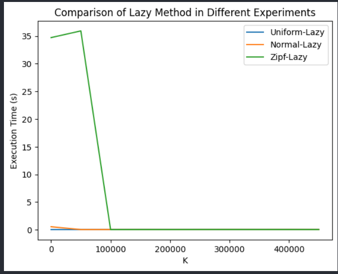

# 随机算法课程实验报告

# 实验一：用minHash实现集合的相似性连接

| 姓名 | 陈峰       |
| ---- | ---------- |
| 学号 | 7203610323 |
| 班级 | 20WJ0313   |

| 评分表：   | （由老师填写） |
| ---------- | -------------- |
| 最终得分： |
对实验题目的理解是否透彻：     
实验步骤是否完整、可信  ：        
代码质量                ：
实验报告是否规范        ：
趣味性、难度加分        ：       
特色1：
特色2：
特色3：

---

# 一、实验题目概述

由于前几周的时间比较充足，所以在做完第一个实验之后，将第二个实验也做了。
比较三种中位数选取算法的效率：
输入：实数集合$R=\{r_1,r_2,…,r_n\}$,正整数$k\in [1,n]$
输出：`min(R,k)`—R中第k小的元素
1.	实现排序之后然后选取第k个元素的算法。
2.	实现一个线性时间的算法。
3.	实现lazyselect算法。
4.	在不同分布的数据上进行实验，并比较实验结果。

---

第二个实验：

QuickSort算法的再探讨：

实验要求在给定的原始的QuickSort的算法上进行优化和改进，使得算法能够在具备大量重复元素的时候依然能够稳定运行。

# 二、对实验步骤的详细阐述

第一个实验：

1. 排序实现算法。直接调用了c++的sort函数。
2. 实现一个线性时间的算法。这里采取的是基于分治的线性选取算法，也就是quicksort的变形，在quicksort选取基准，并对两边递归进行排序的时候，不在对两边进行递归排序，而是对包含k的一边进行排序，从而将quicksort变味了$O(n)$的线性选取算法。
3. 实现lazyselct算法。算法如下
$$
   \begin{aligned}
   & 1. R = 独立、均匀、可放回地从 S 随机选取的 n \times \frac{3}{4} 元素;\\
   & 2. 在 O(n) 时间内排序 R;\\
   & 3. x = \frac{k}{n}n^{\frac{3}{4}};  \\
   & 4. l = \max\{\lfloor x- \sqrt{n} \rfloor, 0\}; h = \min\{\lfloor x+\sqrt{n} \rfloor , n^{\frac{3}{4}}\};\\
   & 5. L = \min(R, l); H = \min(R, h);\\
   & 6. Lp = \text{Rank}(S,L), Hp = \text{Rank}(S,H);\\
   & 7. P = \{y \in S \mid L \leq y \leq H\}; \\
   & 8. If \min(S, k) \in P and |P| \leq 4n^{\frac{3}{4}} + 1 \\
   & 9. Then 排序P, \min(S, k) = \min(P, (k-Lp)), 算法结束;\\
   & 10. ELSE goto  1\\
   \end{aligned}
$$

完全按照算法步骤实现即可。

4. 验证lazyselect算法的正确性。通过和sort进行比较，验证算法的正确性。
5. 进行实验，比较算法运行速度。
6. 总结并对实验结果进行可视化。
---
第二个实验：

在实现基础的quicksort方法之后主要做了以下的优化：

- 使用插入排序优化，在快排的区间小于一定定值（这里我设置的为5）的时候，使用插入排序，而不再进行递归。
- 三路快排。在随机选取基准pivot之后，不分为$\le pivot$和 $>pivot$两个集合，而分为$<pivot$ 、$=pivot$、 $>pivot$三个集合，并且只会在大于和小于两个集合里面进行递归。

实验步骤：
1. 使用所写的函数随机生成100万个整数的11个数据集，满足以下要求
   1. 数组元素各不相同的无序数组；
   2. 一个元素占整个数组的10%, 20%, …，100%而其他元素各不相同

2. 编写三个三个排序函数。
   1. 原始未经修改的quicksort
   2. 经过优化的modified_quicksort.
   3. 编写c++ STL的sort函数。

3. 观察实验现象比进行实验。
4. 总结实验结果，并进行可视化。

#  三、实验数据

## 1. 实验设置

### 实验环境
Window 10 ，visual studio2022，visual studio code

### 实验数据

使用下列三个函数生成的符合均匀、高斯、Zipf分布的数据

---
下列函数随机产生的11个100万整数的数据集。

## 2. 实验结果

**所有实验结果保存在experiment.txt(第一个实验),experimet_quicksort.txt（第二个实验），并使用plot.ipynb进行可视化**

---

**原始的quicksort在10%重复数据的时候就爆栈了，所以这里没有运行结果，我尝试过扩大栈容量，似乎不够，并且运行速度也很慢，在没有爆栈的时候的运行时间已经超过了其他两个算法的运行时间**

# 四、对实验结果的理解和分析

- 本次实验中，我使用了c++的STL库，这是因为c++的STL库中的sort函数是一个稳定的排序算法，而且在数据量较大的时候，效率也很高，所以我使用了该函数作为对比。
- Zipf的数据分布为尾部数据占据绝大部分，这样的数据对于LazySelct的算法来说很难处理，所以在该算法上，该算法运行时间较差，而其他数据分布表现良好。
- LazySelect和基于分治算法的运行时间随着k的取值有着较大变化，这主要是k的取值影响选择的空间。
- 基于分治的quick函数是最快的，因为它是$O(n)$的算法，并且不会重复多次，其次为$LazySelect$，该算法也是$O(n)$，并且期望运行的次数是小于$O(\log n)$的，最后就是基于排序的$O(n\log n)算法$
- 基于分治算法的时间随着k向$\frac{n}{2}$移动，用时也增大，这因为递归的深度变多，而且每次递归的区间也变大，所以时间增加。
- sort方法对数据的分布不敏感，而分治和LazySelect对于数据分布更加敏感。这是因为sort是一个稳定的排序算法，而后两个是随机算法，每次选取的区间是收到数据分布影响的。

---

第二个实验：

- 三路快排的效果比较好，因为它可以将相同的元素分到一起，减少了递归的次数，而且在相同元素较多的时候，可以减少递归的深度。
- 原始的quicksort在单一重复元素较多的时候，会爆栈，这是因为递归的深度太大，而且每次递归的区间也很大，所以爆栈。而修改后，反而降低了算法的运行时间，这是因为修改后的算法可以将相同的元素分到一起，减少了递归的次数，而且在相同元素较多的时候，可以减少递归的深度。
- 使用插入排序进行优化，可以减少递归的次数，但是在单一重复元素较多的时候，递归的深度还是很大，所以运行时间还是很长。

# 五、实验过程中最值得说起的几个方面

- 使用`c++`完成了本次**两个**实验。
- 部分重要函数采取了doxygen风格的注释，能够增强代码可读性和复用性。
- 使用了`python`进行数据可视化，使用了`matplotlib`和`pandas`库对实验结果进行了可视化。
- 对于第二个实验，设计出了插入排序和三路快排的优化方案，并且进行了实验，得到了良好的实验结果。